<div align="left">
  <picture>
    <source media="(prefers-color-scheme: dark)" srcset="https://raw.githubusercontent.com/hud-evals/hud-python/main/docs/logo/hud_logo_dark.svg">
    <source media="(prefers-color-scheme: light)" srcset="https://raw.githubusercontent.com/hud-evals/hud-python/main/docs/logo/hud_logo.svg">
    
  </picture>
</div>

Evaluate and improve agents. Wrap software as environments, run benchmarks, and train with RL – locally or at scale.

[](https://pypi.org/project/hud-python/)
[](LICENSE)
[](https://cursor.com/en/install-mcp?name=docs-hud-python&config=eyJ1cmwiOiJodHRwczovL2RvY3MuaHVkLnNvL21jcCJ9)
[](https://discord.gg/wkjtmHYYjm)
[](https://x.com/intent/user?screen_name=hud_evals)
[](https://shop.hud.so)


### Are you a startup building agents?

[📅 Hop on a call](https://cal.com/jay-ram-z6st6w/demo) or [📧 founders@hud.so](mailto:founders@hud.so)

## Highlights

- 🚀 **MCP-native connectivity** – any agent can call any hud environment.
- ⚡️ **Live telemetry** – inspect every tool call, observation, and reward in real time.
- 🗂️ **Public benchmarks** – OSWorld-Verified, SheetBench-50, and more.
- 🌱 **Reinforcement learning built-in** – Verifiers gym pipelines for GRPO training.
- 🌐 **Cloud browsers** – AnchorBrowser, Steel, BrowserBase integrations for browser automation.
- 🛠️ **Hot-reload dev loop** – edit environments live inside Cursor Agent.

> We welcome contributors and feature requests – open an issue or hop on a call to discuss improvements!

## Installation

```bash
# Core installation - MCP servers, CLI, basic tools for environment design
pip install hud-python

# Agent installation - Adds AI providers, telemetry, datasets
pip install "hud-python[agent]"

# CLI utilities (inside isolated env)
uv tool install hud-python

# From source (latest)
git clone https://github.com/hud-evals/hud-python
pip install -e "hud-python[dev]"
```

> See [docs.hud.so](https://docs.hud.so) for docs, or add as a server to any MCP client:
> `claude mcp add docs-hud https://docs.hud.so/mcp`

## Quick start

For a tutorial that explains the agent and evaluation design, run:

```python
uvx hud-python quickstart
```

Or just write your own agent loop:

```python
import asyncio, hud, os
from hud.settings import settings
from hud.clients import MCPClient
from hud.agents import ClaudeAgent
from hud.datasets import Task

async def main() -> None:
    with hud.trace("Quick Start 2048"): # All telemetry works for any MCP-based agent
        task = Task(
            prompt="Reach 64 in 2048.",
            mcp_config={
                "hud": {
                    "url": "https://mcp.hud.so", # All hud environments work with any MCP client
                    "headers": {
                        "Authorization": f"Bearer {os.getenv('HUD_API_KEY')}",
                        "Mcp-Image": "hudpython/hud-text-2048:v1.1"
                    }
                }
            },
            evaluate_tool={"name": "evaluate", "arguments": {"name": "max_number", "target": 64}},
        )

        # 1. Define the client explicitly:
        client = MCPClient(mcp_config=task.mcp_config)
        agent = ClaudeAgent(
            mcp_client=client,
            model="claude-3-7-sonnet-20250219",  # requires ANTHROPIC_API_KEY
        )

        result = await agent.run(task)

        # 2. Or just:
        # result = await ClaudeAgent().run(task)

        print(f"Reward: {result.reward}")
        await client.close()

asyncio.run(main())
```

> Every HUD environment is MCP-based and interactable from anywhere. Requires `HUD_API_KEY` and `ANTHROPIC_API_KEY`.

## Reinforcement Learning with GRPO

This is a Qwen-2.5-3B agent training a policy on the `text-2048` environment using Verifiers:


To start training:

```bash
git clone https://github.com/hud-evals/hud-python
cd hud-python
python rl/verifiers/train_2048.py
```

Any hud MCP environment and evaluation works with our RL pipeline. Even our remote configurations!

> The `rl/README.md` walks you through several examples of RL training and takes less than 15 minutes to set up for your custom agent!

## Benchmarking Agents

This is an agent running on our proprietary financial analyst benchmark SheetBench-50:


> [See this trace on _app.hud.so_](https://app.hud.so/trace/9e212e9e-3627-4f1f-9eb5-c6d03c59070a)

This example runs the full dataset (only takes ~20 minutes):

```bash
python examples/run_evaluation.py hud-evals/SheetBench-50 --full --agent claude
```

Or in code:

```python
import asyncio
from hud.datasets import run_dataset
from hud.agents import ClaudeAgent

results = await run_dataset(
    name="My SheetBench-50 Evaluation",
    dataset="hud-evals/SheetBench-50",      # <-- HuggingFace dataset
    agent_class=ClaudeAgent,                # <-- Your custom agent can replace this
    agent_config={"model": "claude-3-7-sonnet-20250219"},
    max_concurrent=50,
    max_steps=30,
)
print(f"Average reward: {sum(r.reward for r in results) / len(results):.2f}")
```

> Running a dataset creates a job and streams results to the app.hud.so platform for analysis and leaderboard submission.

## Building Environments (MCP)

This is how you can make any environment into an interactable one in 5 steps:

1. Define MCP server layer

```python
from hud.server import MCPServer
from hud.tools import HudComputerTool

mcp = MCPServer("My Environment")

# Add hud tools
mcp.add_tool(HudComputerTool())

# Or custom tools
@mcp.tool("launch_app"):
def launch_app(name: str = "Gmail")
...

if __name__ == "__main__":
    mcp.run()
```

2. Write a simple Dockerfile that installs packages and runs:

```python
CMD ["python", "-m", "hud_controller.server"]
```

And build the image:

```bash
docker build -t my-name/my-environment:latest .
```

3. Debug it with the CLI to see if it launches:

```bash
$ hud debug my-name/my-environment:latest
[STDIO] Sending: {"jsonrpc": "2.0", "id": 1, "method": "initialize", "params": {"protocolVersion": "2024-11-05", "capabilities": {"roots": {"listChanged": true}}, "clientInfo": {"name": "DebugClient", "version": "1.0.0"}}}
...
Progress: [█████] 5/5 phases (100%)
✅ All phases completed successfully!
```

Analyze it to see if all tools appear (this is how a ready  environment looks):

```bash
$ hud analyze hudpython/hud-remote-browser:latest
⠏ ✓ Analysis complete
...
Tools
├── Regular Tools
│   ├── computer
│   │   └── Control computer with mouse, keyboard, and screenshots
...
└── Hub Tools
    ├── setup
    │   ├── navigate_to_url
    │   ├── set_cookies
    │   ├── ...
    └── evaluate
        ├── url_match
        ├── page_contains
        ├── cookie_exists
        ├── ...

📡 Telemetry Data
 Live URL  https://live.anchorbrowser.io?sessionId=123456789
```

4. When the tests pass, push it up to the docker registry:

```bash
docker push my-name/my-environment:latest
```

5. Now you can use `mcp.hud.so` to launch 100s of instances of this environment in parallel with any agent, and see everything live on app.hud.so:

```python
from hud.agents import ClaudeAgent

result = await ClaudeAgent().run({
    "prompt": "Please explore this environment",
    "mcp_config": {
        "my-environment": {
            "url": "https://mcp.hud.so",
            "headers": {
                "Authorization": f"Bearer {os.getenv('HUD_API_KEY')}",
                "Mcp-Image": "my-name/my-environment"
            }
        }
    }
})

```

> See the full environment design guide and commmon pitfalls in `environments/README.md`

## Leaderboards & benchmarks

All leaderboards are publicly available on [app.hud.so/leaderboards](https://app.hud.so/leaderboards)


We highly suggest running 3-5 evaluations per dataset for the most consistent results across multiple jobs.

Using the `run_dataset` function with a HuggingFace dataset automatically assigns your job to that leaderboard page, and allows you to create a scorecard out of it:

## Architecture

```mermaid
%%{init: { "sequence": { "width":200 } } }%%
graph TB
    subgraph "HUD Platform"
        Dashboard["📊 Dashboard<br/>(app.hud.so)"]
        API["🔌 HUD MCP<br/>(Remote Orchestrator)"]
    end
  
    subgraph "Your Code"
        Agent["🤖 Agent<br/>(Claude/Operator)"]
        Task["📋 Task<br/>(Prompt + Evaluation)"]
        SDK["📦 HUD SDK"]
    end
  
    subgraph "Environments"
        LocalEnv["🖥️ Local Docker<br/>(Development)"]
        RemoteEnv["☁️ Remote Docker<br/>(100s Parallel)"]
    end
  
    subgraph "Telemetry"
        Trace["📡 OpenTelemetry<br/>(Traces & Metrics)"]
    end
  
    Dataset["📚 Dataset<br/>(HuggingFace)"]
  
    AnyMCP["🔗 Any MCP Client<br/>(Cursor, Claude, Custom)"]
  
    Agent <--> SDK
    Task --> SDK
    Dataset <-.-> Task
    SDK <-->|"MCP"| LocalEnv
    SDK <-->|"MCP"| API
    API  <-->|"MCP"| RemoteEnv
    SDK  --> Trace
    Trace --> Dashboard
    AnyMCP -->|"MCP"| API
  
    style Dashboard fill:#e0e7ff,stroke:#6366f1,stroke-width:2px
    style SDK fill:#fef3c7,stroke:#f59e0b,stroke-width:2px
    style RemoteEnv fill:#d1fae5,stroke:#10b981,stroke-width:2px
    style AnyMCP fill:#fce7f3,stroke:#ec4899,stroke-width:2px,stroke-dasharray: 5 5
```



## CLI reference

| Command                 | Purpose                                    |
| ----------------------- | ------------------------------------------ |
| `hud analyze <image>` | Discover tools, resources, and metadata.   |
| `hud debug <image>`   | Five-phase health check of an environment. |
| `hud mcp`             | Expose analysis & debug as an MCP server.  |

## Roadmap

- Merging our forks in to the main `mcp`, `mcp_use`, `verifiers` repositories
- Helpers for building new environments
- Integrations with every major agent framework
- Evaluation environment registry
- Native RL training to hud environments
- MCP opentelemetry standard

## Contributing

We welcome contributions! See [CONTRIBUTING.md](CONTRIBUTING.md) for guidelines.

Thanks to all our contributors!

<a href="https://github.com/hud-evals/hud-python/graphs/contributors">
  
</a>

## Citation

```bibtex
@software{hud2025agentevalplatform,
  author = {HUD and Jay Ram and Lorenss Martinsons and Parth Patel and Oskars Putans and Govind Pimpale and Mayank Singamreddy and Nguyen Nhat Minh},
  title  = {HUD: An Evaluation Platform for Agents},
  date   = {2025-04},
  url    = {https://github.com/hud-evals/hud-python},
  langid = {en}
}
```

> **License**: HUD is released under the MIT License – see the [LICENSE](LICENSE) file for details.
