<div align="left">
  <picture>
    <source media="(prefers-color-scheme: dark)" srcset="https://raw.githubusercontent.com/hud-evals/hud-python/main/docs/logo/hud_logo_dark.svg">
    <source media="(prefers-color-scheme: light)" srcset="https://raw.githubusercontent.com/hud-evals/hud-python/main/docs/logo/hud_logo.svg">
    
  </picture>
</div>

OSS RL environment + evals toolkit. Wrap software as environments, run benchmarks, and train with RL – locally or at scale.

[](https://pypi.org/project/hud-python/)
[](LICENSE)
[](https://cursor.com/en/install-mcp?name=docs-hud-python&config=eyJ1cmwiOiJodHRwczovL2RvY3MuaHVkLnNvL21jcCJ9)
[](https://discord.gg/wkjtmHYYjm)
[](https://x.com/intent/user?screen_name=hud_evals)
[](https://shop.hud.so)


### Are you a startup building agents?

[📅 Hop on a call](https://cal.com/jay-ram-z6st6w/demo) or [📧 founders@hud.so](mailto:founders@hud.so)

## Highlights

- 🎓 **[One-click RL](https://hud.so/models)** – Run `hud rl` to get a trained model on any environment.
- 🚀 **[MCP environment skeleton](https://docs.hud.so/core-concepts/mcp-protocol)** – any agent can call any environment.
- ⚡️ **[Live telemetry](https://hud.so)** – inspect every tool call, observation, and reward in real time.
- 🗂️ **[Public benchmarks](https://hud.so/leaderboards)** – OSWorld-Verified, SheetBench-50, and more.
- 🌐 **[Cloud browsers](environments/remote_browser/)** – AnchorBrowser, Steel, BrowserBase integrations for browser automation.
- 🛠️ **[Hot-reload dev loop](environments/README.md#phase-5-hot-reload-development-with-cursor-agent)** – `hud dev` for iterating on environments without rebuilds.

> We welcome contributors and feature requests – open an issue or hop on a call to discuss improvements!

## Installation

```bash
# SDK - MCP servers, telemetry, evaluation
pip install hud-python

# CLI - RL pipeline, environment design
uv tool install hud-python
# uv tool update-shell
```

> See [docs.hud.so](https://docs.hud.so), or add docs to any MCP client:
> `claude mcp add --transport http docs-hud https://docs.hud.so/mcp`

Before starting, get your HUD_API_KEY at [hud.so](https://hud.so).


## Quickstart: Training

RL using GRPO a Qwen2.5-VL model on any hud dataset:

```bash
hud get hud-evals/basic-2048 # from HF
hud rl basic-2048.json
```

> See [agent training docs](https://docs.hud.so/train-agents/quickstart)

Or make your own environment and dataset:

```bash
hud init my-env && cd my-env
hud dev --interactive
# When ready to run:
hud rl
```

> See [environment design docs](https://docs.hud.so/build-environments)


## Quickstart: Evals

For a tutorial that explains the agent and evaluation design, run:

```python
uvx hud-python quickstart
```

Or just write your own agent loop (more [examples here](examples/)).

```python
import asyncio, hud, os
from hud.settings import settings
from hud.clients import MCPClient
from hud.agents import ClaudeAgent
from hud.datasets import Task  # See docs: https://docs.hud.so/reference/tasks

async def main() -> None:
    with hud.trace("Quick Start 2048"): # All telemetry works for any MCP-based agent (see https://hud.so)
        task = {
            "prompt": "Reach 64 in 2048.",
            "mcp_config": {
                "hud": {
                    "url": "https://mcp.hud.so/v3/mcp",  # HUD's cloud MCP server (see https://docs.hud.so/core-concepts/architecture)
                    "headers": {
                        "Authorization": f"Bearer {settings.api_key}",  # Get your key at https://hud.so
                        "Mcp-Image": "hudpython/hud-text-2048:v1.2"  # Docker image from https://hub.docker.com/u/hudpython
                    }
                }
            },
            "evaluate_tool": {"name": "evaluate", "arguments": {"name": "max_number", "arguments": {"target": 64}}},
        }
        task = Task(**task)

        # 1. Define the client explicitly:
        client = MCPClient(mcp_config=task.mcp_config)
        agent = ClaudeAgent(
            mcp_client=client,
            model="claude-sonnet-4-20250514",  # requires ANTHROPIC_API_KEY
        )

        result = await agent.run(task)

        # 2. Or just:
        # result = await ClaudeAgent().run(task)

        print(f"Reward: {result.reward}")
        await client.shutdown()

asyncio.run(main())
```

The above example let's the agent play 2048 ([See replay](https://hud.so/trace/6feed7bd-5f67-4d66-b77f-eb1e3164604f))


## Reinforcement Learning with GRPO

This is a Qwen‑2.5‑VL‑3B agent training a policy on the 2048-basic browser environment:


Train with the new interactive `hud rl` flow:

```bash
# Install CLI
uv tool install hud-python

# Option A: Run directly from a HuggingFace dataset
hud rl hud-evals/basic-2048

# Option B: Download first, modify, then train
hud get hud-evals/basic-2048
hud rl basic-2048.json

# Optional: baseline evaluation
hud eval basic-2048.json
```

Supports multi‑turn RL for both:
- Language‑only models (e.g., `Qwen/Qwen2.5-7B-Instruct`)
- Vision‑Language models (e.g., `Qwen/Qwen2.5-VL-3B-Instruct`)

By default, `hud rl` provisions a persistent server and trainer in the cloud, streams telemetry to `hud.so`, and lets you monitor/manage models at `hud.so/models`. Use `--local` to run entirely on your machines (typically 2+ GPUs: one for vLLM, the rest for training).

Any HUD MCP environment and evaluation works with our RL pipeline (including remote configurations). See the guided docs: `https://docs.hud.so/train-agents/quickstart`.

Pricing: Hosted vLLM and training GPU rates are listed in the [Training Quickstart → Pricing](https://docs.hud.so/train-agents/quickstart#pricing). Manage billing at the [HUD billing dashboard](https://hud.so/project/billing).

## Benchmarking Agents

This is Claude Computer Use running on our proprietary financial analyst benchmark [SheetBench-50](https://huggingface.co/datasets/hud-evals/SheetBench-50):


> [See this trace on _hud.so_](https://hud.so/trace/9e212e9e-3627-4f1f-9eb5-c6d03c59070a)

This example runs the full dataset (only takes ~20 minutes) using [run_evaluation.py](examples/run_evaluation.py):

```bash
python examples/run_evaluation.py hud-evals/SheetBench-50 --full --agent claude
```

Or in code:

```python
import asyncio
from hud.datasets import run_dataset
from hud.agents import ClaudeAgent

results = await run_dataset(
    name="My SheetBench-50 Evaluation",
    dataset="hud-evals/SheetBench-50",      # <-- HuggingFace dataset
    agent_class=ClaudeAgent,                # <-- Your custom agent can replace this (see https://docs.hud.so/evaluate-agents/create-agents)
    agent_config={"model": "claude-sonnet-4-20250514"},
    max_concurrent=50,
    max_steps=30,
)
print(f"Average reward: {sum(r.reward for r in results) / len(results):.2f}")
```

> Running a dataset creates a job and streams results to the [hud.so](https://hud.so) platform for analysis and [leaderboard submission](https://docs.hud.so/evaluate-agents/leaderboards).

## Building Environments (MCP)

This is how you can make any environment into an interactable one in 5 steps:

1. Define MCP server layer using [`MCPServer`](https://docs.hud.so/reference/environments)

```python
from hud.server import MCPServer
from hud.tools import HudComputerTool

mcp = MCPServer("My Environment")

# Add hud tools (see all tools: https://docs.hud.so/reference/tools)
mcp.tool(HudComputerTool())

# Or custom tools (see https://docs.hud.so/build-environments/adapting-software)
@mcp.tool("launch_app"):
def launch_app(name: str = "Gmail")
...

if __name__ == "__main__":
    mcp.run()
```

2. Write a simple Dockerfile that installs packages and runs:

```python
CMD ["python", "-m", "hud_controller.server"]
```

And build the image:

```bash
hud build # runs docker build under the hood
```

Or run it in interactible mode

```bash
hud dev
```

3. Debug it with the CLI to see if it launches:

```console
$ hud debug my-name/my-environment:latest

✓ Phase 1: Docker image exists
✓ Phase 2: MCP server responds to initialize 
✓ Phase 3: Tools are discoverable
✓ Phase 4: Basic tool execution works
✓ Phase 5: Parallel performance is good

Progress: [█████████████████████] 5/5 phases (100%)
✅ All phases completed successfully!
```

Analyze it to see if all tools appear:

```console
$ hud analyze hudpython/hud-remote-browser:latest
⠏ ✓ Analysis complete
...
Tools
├── Regular Tools
│   ├── computer
│   │   └── Control computer with mouse, keyboard, and screenshots
...
└── Hub Tools
    ├── setup
    │   ├── navigate_to_url
    │   ├── set_cookies
    │   ├── ...
    └── evaluate
        ├── url_match
        ├── page_contains
        ├── cookie_exists
        ├── ...

📡 Telemetry Data
 Live URL  https://live.anchorbrowser.io?sessionId=abc123def456
```

4. When the tests pass, push it up to the docker registry:

```bash
hud push # needs docker login, hud api key
```

5. Now you can use `mcp.hud.so` to launch 100s of instances of this environment in parallel with any agent, and see everything live on [hud.so](https://hud.so):

```python
from hud.agents import ClaudeAgent

result = await ClaudeAgent().run({  # See all agents: https://docs.hud.so/reference/agents
    "prompt": "Please explore this environment",
    "mcp_config": {
        "my-environment": {
            "url": "https://mcp.hud.so/v3/mcp",
            "headers": {
                "Authorization": f"Bearer {os.getenv('HUD_API_KEY')}",
                "Mcp-Image": "my-name/my-environment:latest"
            }
        }
        # "my-environment": { # or use hud run which wraps local and remote running
        #     "cmd": "hud",
        #     "args": [
        #         "run",
        #         "my-name/my-environment:latest",
        #     ]
        # }
    }
})

```

> See the full environment design guide and common pitfalls in [`environments/README.md`](environments/README.md)

## Leaderboards & benchmarks

All leaderboards are publicly available on [hud.so/leaderboards](https://hud.so/leaderboards) (see [docs](https://docs.hud.so/evaluate-agents/leaderboards))


We highly suggest running 3-5 evaluations per dataset for the most consistent results across multiple jobs.

Using the [`run_dataset`](https://docs.hud.so/reference/tasks#run_dataset) function with a HuggingFace dataset automatically assigns your job to that leaderboard page, and allows you to create a scorecard out of it:

## Architecture

```mermaid
%%{init: {"theme": "neutral", "themeVariables": {"fontSize": "14px"}} }%%
graph LR
    subgraph "Platform"
        Dashboard["📊 hud.so"]
        API["🔌 mcp.hud.so"]
    end
  
    subgraph "hud"
        Agent["🤖 Agent"]
        Task["📋 Task"]
        SDK["📦 SDK"]
    end
  
    subgraph "Environments"
        LocalEnv["🖥️ Local Docker<br/>(Development)"]
        RemoteEnv["☁️ Remote Docker<br/>(100s Parallel)"]
    end
  
    subgraph "otel"
        Trace["📡 Traces & Metrics"]
    end
  
    Dataset["📚 Dataset<br/>(HuggingFace)"]
  
    AnyMCP["🔗 Any MCP Client<br/>(Cursor, Claude, Custom)"]
  
    Agent <--> SDK
    Task --> SDK
    Dataset <-.-> Task
    SDK <-->|"MCP"| LocalEnv
    SDK <-->|"MCP"| API
    API  <-->|"MCP"| RemoteEnv
    SDK  --> Trace
    Trace --> Dashboard
    AnyMCP -->|"MCP"| API
  
```



## CLI reference

| Command                 | Purpose                                    | Docs |
| ----------------------- | ------------------------------------------ | ---- |
| [`hud init`](https://docs.hud.so/reference/cli/init)            | Create new environment with boilerplate.  | [📖](https://docs.hud.so/reference/cli/init) |
| [`hud dev`](https://docs.hud.so/reference/cli/dev)              | Hot-reload development with Docker.        | [📖](https://docs.hud.so/reference/cli/dev) |
| [`hud build`](https://docs.hud.so/reference/cli/build)          | Build image and generate lock file.       | [📖](https://docs.hud.so/reference/cli/build) |
| [`hud push`](https://docs.hud.so/reference/cli/push)            | Share environment to registry.            | [📖](https://docs.hud.so/reference/cli/push) |
| [`hud pull <target>`](https://docs.hud.so/reference/cli/pull)   | Get environment from registry.            | [📖](https://docs.hud.so/reference/cli/pull) |
| [`hud analyze <image>`](https://docs.hud.so/reference/cli/analyze) | Discover tools, resources, and metadata.   | [📖](https://docs.hud.so/reference/cli/analyze) |
| [`hud debug <image>`](https://docs.hud.so/reference/cli/debug)   | Five-phase health check of an environment. | [📖](https://docs.hud.so/reference/cli/debug) |
| [`hud run <image>`](https://docs.hud.so/reference/cli/run)       | Run MCP server locally or remotely.       | [📖](https://docs.hud.so/reference/cli/run) |

## Roadmap

- Merging our forks in to the main `mcp`, `mcp_use` repositories
- Helpers for building new environments (see [current guide](environments/README.md))
- Integrations with every major agent framework
- Evaluation environment registry
- MCP opentelemetry standard

## Contributing

We welcome contributions! See [CONTRIBUTING.md](CONTRIBUTING.md) for guidelines.

Key areas:
- [Environment examples](environments/) - Add new MCP environments
- [Agent implementations](hud/agents/) - Add support for new LLM providers
- [Tool library](hud/tools/) - Extend the built-in tool collection
- [RL training](hud/rl/) - Improve reinforcement learning pipelines

Thanks to all our contributors!

<a href="https://github.com/hud-evals/hud-python/graphs/contributors">
  
</a>

## Citation

```bibtex
@software{hud2025agentevalplatform,
  author = {HUD and Jay Ram and Lorenss Martinsons and Parth Patel and Oskars Putans and Govind Pimpale and Mayank Singamreddy and Nguyen Nhat Minh},
  title  = {HUD: An Evaluation Platform for Agents},
  date   = {2025-04},
  url    = {https://github.com/hud-evals/hud-python},
  langid = {en}
}
```

> **License**: HUD is released under the MIT License – see the [LICENSE](LICENSE) file for details.
