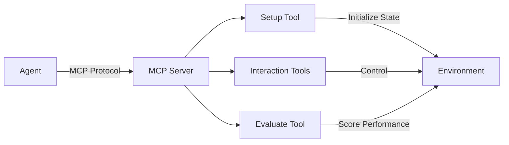

Turn any software that runs in Docker into an agent-testable environment. Whether it's a web app, desktop application, game, or API, HUD provides the tools to make it MCP-compatible.

## What Defines a HUD Environment?

A HUD environment is a Docker container that:

1. **Runs an MCP server** via stdio transport
2. **Implements lifecycle tools** (`setup` and `evaluate`)
3. **Exposes interaction tools** for agents to use
4. **Works identically** locally and remotely

The key is the Docker `CMD` entrypoint - it launches an MCP server that can be connected to by any MCP client, enabling both local development and remote scaling.

## Architecture & Lifecycle



### Lifecycle Flow

1. **Initialize**: MCP handshake establishes connection
2. **Setup**: Prepare environment to known state (hidden from agent)
3. **Interact**: Agent uses tools to complete task
4. **Evaluate**: Score agent's performance (hidden from agent)

## Environment Specification

### Required Components

Every HUD environment must have:

```python
from hud.server import MCPServer

mcp = MCPServer(name="my-environment")

# 1. Setup tool (lifecycle - hidden from agents)
@mcp.tool()
async def setup(**kwargs) -> dict:
    """Initialize environment state"""
    # Reset to known state
    # Load test data
    # Configure settings
    return {"status": "ready"}

# 2. Evaluate tool (lifecycle - hidden from agents)  
@mcp.tool()
async def evaluate(**kwargs) -> dict:
    """Score agent performance"""
    # Check task completion
    # Calculate reward (0-1)
    # Determine if done
    return {
        "reward": 0.8,
        "done": True,
        "info": {"details": "..."}
    }

# 3. Interaction tools (visible to agents)
@mcp.tool()
async def perform_action(param: str) -> dict:
    """Tool agents use to interact"""
    # Modify environment state
    # Return feedback
    return {"result": "success"}
```

### Standard File Structure

```
my-environment/
├── Dockerfile              # Container definition
├── pyproject.toml          # Python package config
├── README.md               # Environment documentation
└── src/
    └── hud_controller/     # Standard package name
        ├── __init__.py
        ├── server.py       # MCP server entry point
        ├── context.py      # Environment state (optional)
        ├── setup/          # Setup functions (if using hub)
        ├── evaluate/       # Evaluation functions (if using hub)
        └── tools/          # Custom interaction tools
```

### Docker Requirements

The Dockerfile must:
- Install dependencies
- Copy source code
- Set proper working directory
- **Define CMD that runs the MCP server**

```dockerfile
FROM python:3.11-slim

WORKDIR /app

# Copy and install
COPY pyproject.toml ./
COPY src/ ./src/
RUN pip install -e .

# Critical: Launch MCP server on stdio
CMD ["python", "-m", "hud_controller.server"]
```

This `CMD` is what enables the same image to work both locally and remotely:
- Locally: `docker run -i` pipes stdio
- Remotely: HUD platform manages stdio transport

## MCPServer vs FastMCP

The HUD SDK provides `MCPServer`, which extends FastMCP with Docker-friendly features:

### What MCPServer Adds

1. **SIGTERM Handling**: Graceful shutdown in containers
   ```python
   mcp = MCPServer(name="my-env")
   mcp.run()  # Automatically handles SIGTERM
   ```

2. **Initialize Decorator**: Async setup during MCP handshake
   ```python
   @mcp.initialize
   async def initialize_environment(ctx):
       # ctx.session: MCP ServerSession
       # ctx.meta: Metadata from client
       # ctx.meta.progressToken: For progress updates
       await setup_resources()
   ```

3. **Shutdown Decorator**: Cleanup after lifespan
   ```python
   @mcp.shutdown
   async def cleanup():
       await close_connections()
   ```

4. **BaseTool Support**: Enhanced tool registration
   ```python
   from hud.tools.base import BaseTool
   
   custom_tool = MyTool()  # Inherits from BaseTool
   mcp.add_tool(custom_tool)  # Uses tool.mcp automatically
   ```

## Common MCP Types

### Tool Outputs

All tools should return standardized types:

```python
from mcp.types import ContentBlock, TextContent, ImageContent

# Text output
return [TextContent(text="Operation complete", type="text")]

# Image output
return [ImageContent(
    data=base64_screenshot,
    mimeType="image/png",
    type="image"
)]

# Multiple outputs
return [
    TextContent(text="Status: Ready", type="text"),
    ImageContent(data=screenshot, mimeType="image/png", type="image")
]
```

### Evaluation Results

```python
from hud.tools.types import EvaluationResult

return EvaluationResult(
    reward=0.8,        # Score between 0-1
    done=True,         # Task complete?
    content="Details", # Optional description
    info={             # Additional metadata
        "score": 80,
        "threshold": 75
    }
)
```

## Quick Example

Here's a minimal environment:

```python
from hud.server import MCPServer
from mcp.types import TextContent

mcp = MCPServer(name="counter-env")

# State
counter = 0

@mcp.tool()
async def setup(start_value: int = 0):
    """Reset counter to starting value"""
    global counter
    counter = start_value
    return {"status": "ready", "counter": counter}

@mcp.tool()
async def increment():
    """Increment the counter"""
    global counter
    counter += 1
    return [TextContent(text=f"Counter: {counter}", type="text")]

@mcp.tool()
async def evaluate(target: int):
    """Check if counter reached target"""
    global counter
    return {
        "reward": 1.0 if counter >= target else counter / target,
        "done": counter >= target,
        "info": {"counter": counter, "target": target}
    }

if __name__ == "__main__":
    mcp.run()
```

## Getting Started

<CardGroup cols={3}>
<Card title="TODO Tutorial" icon="list-check" href="/build-environments/quickstart-todo">
  Build your first environment step-by-step
</Card>

<Card title="Adapting Software" icon="wrench" href="/build-environments/docker-to-mcp">
  Patterns for wrapping existing applications
</Card>

<Card title="Advanced Design" icon="rocket" href="/build-environments/registry">
  Hub pattern, telemetry, and production tips
</Card>
</CardGroup>

## Reference Implementations

Study these examples:

### text_2048 (Simple)
- ASCII game with clear state
- Custom move tool
- Simple evaluation logic

### remote_browser (Complex)
- Multi-provider browser automation
- Hub pattern for dozens of functions
- Production telemetry

## Key Concepts

### Tool Categories

1. **Setup Tools**: Initialize state (hidden from agents)
2. **Evaluate Tools**: Score performance (hidden from agents)  
3. **Interaction Tools**: What agents use to control the environment

### MCP Communication

- **stdout**: Reserved for MCP protocol (JSON-RPC)
- **stderr**: All logs and debug output
- **stdio transport**: How containers communicate

### Testing Your Environment

```bash
# Debug all phases
hud debug my-environment:latest

# Analyze available tools
hud analyze my-environment:latest
```

## SDK Reference

<CardGroup cols={2}>
<Card title="MCPServer Reference" icon="server" href="/reference/environments">
  Complete API documentation for MCPServer
</Card>

<Card title="Tools Reference" icon="wrench" href="/reference/tools">
  Available tools and executors
</Card>
</CardGroup>

## Next Steps

<Info>
For the complete step-by-step guide with all implementation details, see the [environments README](https://github.com/hud-evals/hud-python/blob/main/environments/README.md).
</Info>