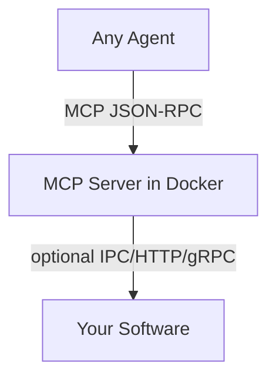

If your Docker image starts a stdio MCP server on container startup, it is a hud environment.

## Architecture



- The MCP server can be written in any language or framework.
- Your software can be anything (service, desktop app, game, scripts). The connection between them is your choice.
- Logs must go to stderr; stdout is reserved for MCP protocol packets.

## Minimal requirements

- Docker image starts a process that speaks MCP on stdout/stdin (stdio) by default.
- No non‑MCP output on stdout (all logging to stderr).
- No required file layout, framework, or endpoints.

Recommended (for HUD RL/evals): provide tools named `setup` and `evaluate`.

## Make it runnable remotely (mcp.hud.so)

Remote execution is built‑in. Push your image, then either:

- CLI (default is remote):

```bash
export HUD_API_KEY=...
hud push
hud run myorg/my-env:latest   # remote container with MCP
```

- Programmatic (Task config):

```json
{
  "mcp_config": {
    "hud": {
      "url": "https://mcp.hud.so/v3/mcp",
      "headers": {
        "Authorization": "Bearer ${HUD_API_KEY}",
        "Mcp-Image": "myorg/my-env:latest"
      }
    }
  }
}
```

## Run arbitrary configs locally or remotely

- Local Docker (stdio):

```bash
hud run myorg/my-env:latest --local --transport stdio
```

- Local HTTP proxy (for inspectors):

```bash
hud run myorg/my-env:latest --local --transport http --port 8765
```

- Remote (default):

```bash
hud run myorg/my-env:latest
```

## Notes

- Use `hud dev` only for local hot‑reload workflows; for production, build once and `hud run`.
- Use `hud debug` only when startup/compliance issues occur.
- Any MCP‑speaking Docker image works; controller/backend split is optional.

## Task config examples

```python
from hud.datasets import Task

task = Task(
    prompt="...",
    mcp_config={
        "hud": {
            "url": "https://mcp.hud.so/v3/mcp",
            "headers": {
                "Authorization": "Bearer ${HUD_API_KEY}",
                "Mcp-Image": "myorg/my-env:latest"
            }
        }
    },
)
```

The same structure is used by `hud init`’s template and by programmatic tasks.

- Programmatic (inline in code):

```json
{
  "mcp_config": {
    "hud": {
      "url": "https://mcp.hud.so/v3/mcp",
      "headers": {
        "Authorization": "Bearer ${HUD_API_KEY}",
        "Mcp-Image": "myorg/my-env:latest"
      }
    }
  },
  "agent_config": {
    "allowed_tools": ["act"]
  },
  "setup_tool": { "name": "setup", "arguments": {} },
  "evaluate_tool": { "name": "evaluate", "arguments": {"target": 10} }
}
```

- File `tasks.json` (created by `hud init` templates), local dev variant:

```json
[
  {
    "prompt": "Increment the counter to reach 10",
    "mcp_config": {
      "local": {
        "command": "docker",
        "args": ["run", "--rm", "-i", "my-env:latest"]
      }
    },
    "agent_config": {
      "allowed_tools": ["act"]
    },
    "setup_tool": { "name": "setup", "arguments": {} },
    "evaluate_tool": { "name": "evaluate", "arguments": {"target": 10} }
  }
]
```

Switching this file to remote is as simple as replacing the `mcp_config` with the `hud` section shown above (or using `hud rl`, which will help convert it automatically).

Run tasks with either the CLI or an agent:

```bash
# Evaluate tasks with an agent backend
hud eval tasks.json --agent claude
```

or programmatically by passing the Task to your agent (e.g., `ClaudeAgent`, `OpenAIChatAgent`).
