HUD is built as a thin orchestration layer on top of MCP, providing structure for agent evaluation, environment management, and telemetry.

## System Overview

```mermaid
graph TB
    subgraph "Remote"
        Dashboard["📊 Dashboard<br/>(hud.ai)"]
        API["🔌 MCP Orchestrator<br/>(mcp.hud.so)"]
    end
    
    subgraph Code["Your Code"]
        Agent["🤖 Agent<br/>(Claude/Operator)"]
        Task["📋 Task<br/>(Prompt + Evaluation)"]
        SDK["📦 hud-python"]
    end
    
    subgraph "Environments"
        LocalEnv["🖥️ Local Docker<br/>(Development)"]
        RemoteEnv["☁️ Remote Docker<br/>(100s Parallel)"]
    end
    
    subgraph "OpenTelemetry"
        Trace["📡 Traces & Metrics"]
    end
    
    Dataset["📚 Dataset<br/>(HuggingFace)"]
    
    AnyMCP["🔗 Any MCP Client<br/>(Cursor, Claude, Custom)"]
    
    Agent <--> SDK
    Task --> SDK
    Dataset <-.-> Task
    SDK <-->|"MCP"| LocalEnv
    SDK <-->|"MCP"| API
    API  <-->|"MCP"| RemoteEnv
    SDK  -->|"hud.trace"| OpenTelemetry
    Trace --> Dashboard
    AnyMCP -->|"MCP"| API
    
    style Dashboard fill:#3b82f6,stroke:#1e40af,stroke-width:2px,color:#ffffff
    style API fill:#6b7280,stroke:#374151,stroke-width:2px,color:#ffffff
    style Agent fill:#ef4444,stroke:#dc2626,stroke-width:2px,color:#ffffff
    style Task fill:#f97316,stroke:#ea580c,stroke-width:2px,color:#ffffff
    style SDK fill:#f59e0b,stroke:#d97706,stroke-width:2px,color:#ffffff
    style LocalEnv fill:#06b6d4,stroke:#0891b2,stroke-width:2px,color:#ffffff
    style RemoteEnv fill:#10b981,stroke:#047857,stroke-width:2px,color:#ffffff
    style Trace fill:#84cc16,stroke:#65a30d,stroke-width:2px,color:#ffffff
    style Dataset fill:#a855f7,stroke:#9333ea,stroke-width:2px,color:#ffffff
    style AnyMCP fill:#8b5cf6,stroke:#7c3aed,stroke-width:2px,color:#ffffff,stroke-dasharray: 5 5
  
```



## Core Components

### 1. Agents (`hud.agents`)

Agents make decisions and call tools:

```python
from hud.agents import ClaudeAgent, OperatorAgent

# Built-in agents
agent = ClaudeAgent()      # Uses Anthropic's Claude
agent = OperatorAgent()    # Uses OpenAI Operator

# All agents inherit from MCPAgent
class MCPAgent:
    async def initialize(task: str | Task | None)
    async def run(prompt_or_task: str | Task, max_steps: int = 10) -> Trace
    async def call_tools(tool_calls: list[MCPToolCall]) -> list[MCPToolResult]
```

<Note>
Agents can auto-create MCP clients from `task.mcp_config` - no manual client setup needed
</Note>

### 2. Tasks (`hud.Task`)

Tasks define what agents should accomplish:

```python
from hud.datasets import Task

task = Task(
    prompt="Complete 3 items in the TODO list",
    mcp_config={
        "hud": {
            "url": "https://mcp.hud.so/v3/mcp",
            "headers": {
                "Authorization": f"Bearer {api_key}",
                "Mcp-Image": "hudpython/hud-browser:latest"
            }
        }
    },
    # Tool names and arguments map directly to MCP server tools
    setup_tool={
        "name": "setup",  # Calls def setup(name, num_items) on the environment
        "arguments": {
            "name": "todo_seed",
            "num_items": 5
        }
    },
    evaluate_tool={
        "name": "evaluate",  # Calls def evaluate(name, expected_count) on the environment
        "arguments": {
            "name": "todo_completed",
            "expected_count": 3
        }
    }
)
```

<Note>
The `name` and `arguments` in setup/evaluate tools correspond exactly to the tool names and parameters exposed by the MCP server
</Note>

### 3. MCP Clients (`hud.clients`)

Clients handle the MCP protocol:

```python
from hud.clients import MCPClient

# Auto-created by agents, or manual:
client = MCPClient(mcp_config)
await client.initialize()
tools = await client.list_tools()
```

### 4. Environments

Environments are MCP servers exposing tools:

```python
from hud.server import MCPServer

server = MCPServer("my-env")

@server.tool()
def move(direction: str):
    # Environment logic
    return result
```

### 5. Telemetry (`hud.trace`)

Real-time observability:

```python
import hud

with hud.trace("my-evaluation"):
    result = await agent.run(task)
    # View at hud.ai/traces/{trace_id}
```

## Execution Flow

<Steps>
<Step title="Task Definition">
  Create a `Task` with prompt and MCP configuration
</Step>

<Step title="Agent Initialization">
  Agent creates MCP client (if needed) and connects to environment
</Step>

<Step title="Setup Phase">
  Execute `setup_tool` to initialize environment state
</Step>

<Step title="Execution Loop">
  Agent receives observations, makes decisions, calls tools
</Step>

<Step title="Evaluation">
  Execute `evaluate_tool` to score performance
</Step>

<Step title="Telemetry">
  All interactions streamed to HUD backend for analysis
</Step>
</Steps>

## Key Design Principles

1. **Protocol-First**: Everything speaks MCP
2. **Composable**: Mix and match agents, environments, evaluations
3. **Observable**: Built-in telemetry for every interaction
4. **Testable**: Reproducible evaluations with Docker
5. **Extensible**: Easy to add new agents or environments

<Note>
The `MCPServer` class wraps FastMCP with lifecycle management, making it easy to build Docker-based environments
</Note>

## Next Steps

<CardGroup cols={2}>
<Card title="Evaluate Agents" icon="robot" href="/evaluate-agents/create-agents">
  Test and benchmark agents on standardized tasks
</Card>

<Card title="Build Environments" icon="cube" href="/build-environments">
  Create MCP-compatible environments for your software
</Card>
</CardGroup>

