Tasks define what agents should do and how to measure success. They combine a prompt, environment configuration, and optional setup/evaluation phases.

## Lifecycle

```mermaid
graph LR
    Task["📋 Task<br/>(Prompt + Config)"]
    Setup["🔧 Setup Phase<br/>(Initialize State)"]
    Execute["🤖 Execute Phase<br/>(Agent Works)"]
    Evaluate["📊 Evaluate Phase<br/>(Score Result)"]
    
    Task --> Setup
    Setup --> Execute
    Execute --> Evaluate
    
    style Task fill:#6366f1,stroke:#4338ca,stroke-width:2px,color:#ffffff
    style Setup fill:#ef4444,stroke:#dc2626,stroke-width:2px,color:#ffffff
    style Execute fill:#f59e0b,stroke:#d97706,stroke-width:2px,color:#ffffff
    style Evaluate fill:#10b981,stroke:#047857,stroke-width:2px,color:#ffffff
```



## Task Structure

```python
from hud.datasets import Task
import uuid

task = Task(
    # Required fields
    prompt="Navigate to the login page and sign in as testuser@example.com",
    mcp_config={
        "hud": {
            "url": "https://mcp.hud.so/v3/mcp",
            "headers": {
                "Authorization": "Bearer ${HUD_API_KEY}",
                "Mcp-Image": "hudpython/hud-browser:latest"
            }
        }
    },
    
    # Optional fields
    id=str(uuid.uuid4()),  # Required for HuggingFace datasets
    system_prompt="You are an expert web automation agent. Always verify page loads before interacting with elements.",
    setup_tool={
        "name": "playwright",
        "arguments": {
            "action": "navigate",
            "url": "https://example.com"
        }
    },
    evaluate_tool={
        "name": "evaluate",
        "arguments": {
            "name": "url_contains",
            "substring": "/dashboard"
        }
    },
    metadata={"category": "authentication", "difficulty": "easy"}
)
```

## Field Reference

<ParamField body="prompt" type="string" required>
  The instruction given to the agent. Be specific and clear about success criteria.
</ParamField>

<ParamField body="mcp_config" type="object" required>
  Environment connection configuration. Supports environment variables with `${VAR}` syntax.
</ParamField>

<ParamField body="id" type="string (UUID)" optional>
  Unique identifier. Required when creating HuggingFace datasets. Use `str(uuid.uuid4())`.
</ParamField>

<ParamField body="system_prompt" type="string" optional>
  Custom system prompt for the agent. Overrides the agent's default system prompt.
</ParamField>

<ParamField body="setup_tool" type="dict | list[dict]" optional>
  Tool(s) to initialize environment state with `name` and `arguments`
</ParamField>

<ParamField body="evaluate_tool" type="dict | list[dict]" optional>
  Tool(s) to score performance with `name` and `arguments`
</ParamField>

<ParamField body="metadata" type="object" optional>
  Additional task information for analysis and filtering
</ParamField>


## Environment Variables

<Important>
Tasks automatically resolve `${VAR}` patterns when deserialized from dictionaries. This is why HuggingFace datasets should store raw dictionaries, not Task objects.
</Important>

```python
# In dataset JSON:
{
    "prompt": "Complete the TODO list",
    "mcp_config": {
        "hud": {
            "url": "https://mcp.hud.so/v3/mcp",
            "headers": {
                "Authorization": "Bearer ${HUD_API_KEY}",
                "Mcp-Image": "${BROWSER_IMAGE}"
            }
        }
    }
}

# When loaded:
task = Task(**task_dict)  # Variables resolved here!
# Now task.mcp_config["hud"]["headers"]["Authorization"] = "Bearer sk-hud-..."
```

This enables:
- **Public datasets** without exposing secrets
- **Environment-specific** configurations
- **CI/CD pipelines** with different credentials

## Running Tasks

```python
# Agent automatically handles all phases
result = await agent.run(task)
print(f"Success: {result.reward}")  # 0.0 to 1.0
```

The agent will:
1. Execute `setup_tool` if provided
2. Work on the `prompt` using available tools
3. Execute `evaluate_tool` to calculate reward

## Working with Datasets

Tasks integrate with HuggingFace datasets:

```python
from datasets import load_dataset
from hud.datasets import run_dataset

# Load dataset from HuggingFace
dataset = load_dataset("hud-evals/SheetBench-50", split="train")

# Run agent on entire dataset with automatic parallelization
results = await run_dataset(
    "SheetBench Run",
    dataset,  # Pass the dataset object or name (e.g. "hud-evals/SheetBench-50")
    agent_class=ClaudeAgent
)
```

## Creating Datasets

```python
from hud.datasets import save_tasks

# Create task dictionaries (NOT Task objects!)
task_dicts = [
    {
        "prompt": "Navigate to the login page",
        "mcp_config": {
            "hud": {
                "url": "${MCP_URL}",
                "headers": {"Authorization": "Bearer ${HUD_API_KEY}"}
            }
        },
        "setup_tool": {"name": "playwright", "arguments": {"action": "navigate", "url": "https://example.com"}},
        "evaluate_tool": {"name": "url_match", "arguments": {"pattern": ".*/login"}}
    },
    # More task dicts...
]

# Save to HuggingFace (preserves ${VAR} templates)
save_tasks(task_dicts, "my-org/my-benchmark")
```

<Warning>
Always save dictionaries, not Task objects. Task objects have already resolved environment variables!
</Warning>

## Best Practices

1. **Use UUIDs**: Always include `id=str(uuid.uuid4())` for dataset tasks
2. **Clear Prompts**: Be specific about success criteria
3. **Template Variables**: Use `${VAR}` syntax for shareable configs
4. **Rich Tools**: Include both `name` and `arguments` in tool definitions

## Next Steps

<CardGroup cols={2}>
<Card title="Benchmarks" icon="flask" href="/evaluate-agents/benchmarks">
  Create, run, and publish evaluations
</Card>

<Card title="Create Agents" icon="robot" href="/evaluate-agents/create-agents">
  Build your own MCP-compatible agent
</Card>
</CardGroup>

