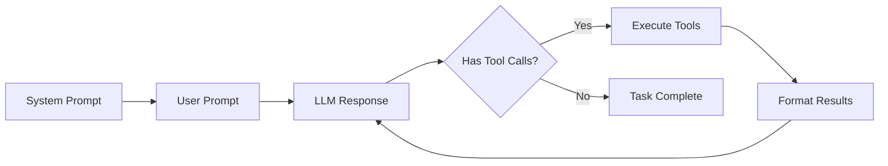

Build custom agents that interact with MCP tools to complete tasks. An agent is essentially a loop that calls your LLM, executes tools based on its decisions, and continues until the task is complete.

## How Agents Work

An agent follows this lifecycle:



The agent keeps calling your LLM and executing tools until the LLM stops requesting tools, indicating the task is complete.

## The Four Required Methods

To create an agent, you implement four methods that bridge your LLM with MCP's tool system:

```python
from hud.agents import MCPAgent
from hud.types import AgentResponse, MCPToolCall, MCPToolResult

class MyAgent(MCPAgent):
    """Your custom agent implementation."""

    async def get_system_messages(self) -> list[Any]:
        """1. Called ONCE at start - returns your LLM's system prompt."""
        pass

    async def get_response(self, messages: list[Any]) -> AgentResponse:
        """2. Called EACH TURN - sends messages to your LLM, returns its response."""
        pass

    async def format_blocks(self, blocks: list[ContentBlock]) -> list[Any]:
        """3. Called at START - converts initial prompt/context to your LLM format."""
        pass

    async def format_tool_results(
        self, tool_calls: list[MCPToolCall],
        tool_results: list[MCPToolResult]
    ) -> list[Any]:
        """4. Called AFTER TOOLS - converts tool results to your LLM format."""
        pass
```

### Understanding When Each Method is Called

The agent loop calls your methods in this sequence:

1. **`get_system_messages()`** - Once at start
2. **`format_blocks()`** - Converts initial task prompt
3. **`get_response()`** - Gets LLM decision
4. **`format_tool_results()`** - After each tool execution
5. Back to step 3 until done

## Complete Implementation Example

Here's a working agent for OpenAI-compatible APIs:

```python
from hud.agents import MCPAgent
from hud.types import AgentResponse, MCPToolCall, MCPToolResult
from openai import AsyncOpenAI
import json

class MyOpenAIAgent(MCPAgent):
    def __init__(self, api_key: str, model: str = "gpt-4", **kwargs):
        super().__init__(**kwargs)
        self.client = AsyncOpenAI(api_key=api_key)
        self.model = model

    async def get_system_messages(self) -> list[dict]:
        """System prompt - called once at start."""
        return [{
            "role": "system",
            "content": self.system_prompt or "You are a helpful assistant that uses tools."
        }]

    async def get_response(self, messages: list[dict]) -> AgentResponse:
        """Main decision point - called each turn."""
        # Convert MCP tools to OpenAI format
        tools = []
        for tool in self.get_available_tools():  # Base class provides filtered tools
            tools.append({
                "type": "function",
                "function": {
                    "name": tool.name,
                    "description": tool.description,
                    "parameters": tool.inputSchema or {}
                }
            })

        # Call OpenAI
        response = await self.client.chat.completions.create(
            model=self.model,
            messages=messages,
            tools=tools if tools else None
        )

        # Parse tool calls
        tool_calls = []
        choice = response.choices[0]
        if choice.message.tool_calls:
            for tc in choice.message.tool_calls:
                tool_calls.append(MCPToolCall(
                    name=tc.function.name,
                    arguments=json.loads(tc.function.arguments),
                    id=tc.id
                ))

        return AgentResponse(
            content=choice.message.content or "",
            tool_calls=tool_calls,
            done=len(tool_calls) == 0  # Stop if no tools requested
        )

    async def format_blocks(self, blocks: list) -> list[dict]:
        """Convert initial prompt to OpenAI format."""
        content = []
        for block in blocks:
            if block.type == "text":
                content.append({"type": "text", "text": block.text})
            elif block.type == "image":
                content.append({
                    "type": "image_url",
                    "image_url": {"url": f"data:{block.mime_type};base64,{block.data}"}
                })

        return [{"role": "user", "content": content}]

    async def format_tool_results(
        self,
        tool_calls: list[MCPToolCall],
        tool_results: list[MCPToolResult]
    ) -> list[dict]:
        """Convert tool results back to OpenAI format."""
        messages = []

        # Add assistant's tool call message
        messages.append({
            "role": "assistant",
            "content": None,
            "tool_calls": [{
                "id": call.id,
                "type": "function",
                "function": {
                    "name": call.name,
                    "arguments": json.dumps(call.arguments)
                }
            } for call in tool_calls]
        })

        # Add tool results
        for call, result in zip(tool_calls, tool_results):
            content = ""
            if result.content:
                for block in result.content:
                    if hasattr(block, 'text'):
                        content += block.text

            messages.append({
                "role": "tool",
                "tool_call_id": call.id,
                "content": content or "Tool executed successfully"
            })

        return messages
```

## What MCPAgent Does For You

### The Agent Loop

The base `MCPAgent` class handles the entire execution loop. When you call `agent.run(task)`:

1. **Initialization Phase**
   - Connects to MCP servers (auto-creates client from task.mcp_config if needed)
   - Discovers available tools from all connected servers
   - Applies tool filtering (allowed/disallowed lists)
   - Identifies lifecycle tools (setup, evaluate, response)

2. **Setup Phase** (if task.setup_tool provided)
   - Executes setup tools (e.g., navigate to website, initialize environment)
   - Optionally appends setup output to initial context (controlled by `append_setup_output`)
   - Can include initial screenshots (controlled by `initial_screenshot`)

3. **Main Execution Loop**
   ```python
   while not done and step < max_steps:
       # Your get_response() is called here
       response = await agent.get_response(messages)

       if response.tool_calls:
           # MCPAgent executes tools for you
           results = await agent.call_tools(response.tool_calls)

           # Your format_tool_results() is called here
           messages.extend(await agent.format_tool_results(tool_calls, results))
       else:
           done = True
   ```

4. **Evaluation Phase** (if task.evaluate_tool provided)
   - Runs evaluation tools to calculate reward
   - Extracts reward from result (looks for "reward", "grade", "score" keys)
   - Returns Trace object with full execution history

### Tool Management

**Tool Discovery & Filtering**
```python
agent = MyOpenAIAgent(
    api_key="...",
    allowed_tools=["click", "type", "screenshot"],  # Only these tools
    disallowed_tools=["execute_script"],  # Never these tools
    lifecycle_tools=["setup", "evaluate"]  # Hidden from LLM
)
```

- **Available Tools**: Retrieved via `self.get_available_tools()` - already filtered
- **Lifecycle Tools**: Automatically detected and hidden from your LLM
- **Response Tools**: Auto-detected (tools with "response" in name) for task completion

### Client Management

MCPAgent handles complex client lifecycle:

```python
# Option 1: Provide your own client
from hud.clients import MCPClient
client = MCPClient(mcp_config={...})
agent = MyAgent(mcp_client=client)

# Option 2: Auto-create from task
task = Task(mcp_config={...})
agent = MyAgent()  # No client needed
await agent.run(task)  # Client created automatically
```

**Auto-cleanup**: Clients created automatically are properly shut down after execution.

### Error Handling

MCPAgent provides robust error handling:

- **Connection Errors**: Helpful messages about MCP server availability
- **Tool Errors**: Captured and returned as MCPToolResult with isError=True
- **Timeout Handling**: Graceful shutdown on tool execution timeouts
- **Trace Always Returns**: Even on errors, you get a Trace object with details

### Message Accumulation

Messages build up over the conversation:

```
[System] → [User Prompt] → [LLM Response] → [Tool Results] → [LLM Response] → ...
```

Your `get_response()` receives the full conversation history each time, allowing your LLM to maintain context.

### Advanced Features

**Response Agent Integration**
```python
from hud.agents.misc import ResponseAgent

agent = MyAgent(
    response_agent=ResponseAgent()  # Auto-decides when to stop/continue
)
```

The ResponseAgent can analyze ambiguous LLM responses like "Should I submit?" and decide whether to continue.

**Telemetry & Tracing**
```python
agent = MyAgent(
    auto_trace=True,  # Automatic span creation
    verbose=True  # Detailed logging
)
```

**System Prompt Augmentation**
```python
task = Task(
    system_prompt="Additional instructions...",  # Appended to agent's system prompt
    ...
)
```

## Testing Your Agent

Test your agent on a simple task:

```python
from hud.agents import MCPAgent
from hud.types import AgentResponse, MCPToolCall, MCPToolResult
from typing import Any
import json

class CustomAgent(MCPAgent):
    """Custom agent implementation for any LLM provider."""
    
    def __init__(self, model: str = "your-model", **kwargs):
        super().__init__(**kwargs)
        self.model = model
        # Initialize your LLM client here
        # self.client = YourLLMClient()
    
    async def get_system_messages(self) -> list[Any]:
        """Return system messages for your LLM.
        
        This method should return the system prompt and any other
        initialization messages in your LLM's expected format.
        """
        prompt = self.system_prompt or "You are a helpful assistant that uses tools to complete tasks."
        return [{"role": "system", "content": prompt}]
    
    async def get_response(self, messages: list[Any]) -> AgentResponse:
        """Generate agent response with tool calls.
        
        This is where you call your LLM and parse the response into
        tool calls. Convert available MCP tools to your LLM's format.
        """
        # Convert MCP tools to your LLM's tool format
        tools = [
            {
                "name": tool.name,
                "description": tool.description,
                "parameters": tool.inputSchema
            }
            for tool in self.get_available_tools()  # Use this method instead
        ]
        
        # Call your LLM with tools
        response = await self.call_llm(messages, tools)
        
        # Parse tool calls from response
        tool_calls = self.parse_tool_calls(response)
        
        return AgentResponse(
            content=response.get("content", ""),
            tool_calls=tool_calls
        )
    
    async def format_blocks(self, blocks: list[Any]) -> list[Any]:
        """Format content blocks for your LLM.
        
        Convert MCP content blocks (text, images) into your LLM's
        message format.
        """
        messages = []
        for block in blocks:
            if block.type == "text":
                messages.append({"role": "user", "content": block.text})
            elif block.type == "image":
                # Handle image blocks if your LLM supports them
                messages.append({
                    "role": "user", 
                    "content": [
                        {"type": "image", "image": block.data}
                    ]
                })
        return messages
    
    async def format_tool_results(
        self, 
        tool_calls: list[MCPToolCall], 
        tool_results: list[MCPToolResult]
    ) -> list[Any]:
        """Format tool results for your LLM.
        
        Convert tool call results back into your LLM's message format.
        """
        messages = []
        
        # Add assistant message with tool calls
        messages.append({
            "role": "assistant",
            "tool_calls": [
                {
                    "id": call.id,
                    "name": call.name,
                    "arguments": call.arguments
                }
                for call in tool_calls
            ]
        })
        
        # Add tool results
        for call, result in zip(tool_calls, tool_results):
            content = json.dumps(result.content) if result.content else ""
            messages.append({
                "role": "tool",
                "tool_call_id": call.id,
                "content": content
            })
        
        return messages

    # Helper methods you'll need to implement
    async def call_llm(self, messages: list[Any], tools: list[Any]) -> dict:
        """Call your LLM API and return the response."""
        # Implement your LLM API call here
        pass
    
    def parse_tool_calls(self, response: dict) -> list[MCPToolCall]:
        """Parse tool calls from your LLM's response format."""
        # Implement parsing logic for your LLM's tool call format
        pass
```

## Testing Your Agent

Test your agent on a simple task:

```python
import asyncio
import hud
import os
from hud.datasets import Task

async def test_agent():
    with hud.trace("test-custom-agent"):
        task = Task(
            prompt="Navigate to example.com",
            mcp_config={
                "hud": {
                    "url": "https://mcp.hud.so/v3/mcp",
                    "headers": {
                        "Authorization": f"Bearer {os.getenv('HUD_API_KEY')}",
                        "Mcp-Image": "hudpython/hud-remote-browser:latest"
                    }
                }
            },
            setup_tool={
                "name": "setup",
                "arguments": {
                    "name": "navigate",
                    "arguments": {"url": "https://example.com"}
                }
            },
            evaluate_tool={
                "name": "evaluate",
                "arguments": {
                    "name": "url_match",
                    "arguments": {"pattern": "example.com"}
                }
            }
        )
        
        # Use your custom agent
        agent = MyOpenAIAgent(api_key=os.getenv("OPENAI_API_KEY"))
        result = await agent.run(task)
        print(f"Reward: {result.reward}")

asyncio.run(test_agent())
```

## Built-in Agents

HUD provides built-in agents for common LLM providers:

```python
from hud.agents import ClaudeAgent, OpenAIAgent, OperatorAgent

# Claude (Anthropic)
claude_agent = ClaudeAgent(
    model="claude-3-opus-20240229",
    api_key=os.getenv("ANTHROPIC_API_KEY")
)

# OpenAI GPT-4
openai_agent = OpenAIAgent(
    model="gpt-4-turbo-preview",
    api_key=os.getenv("OPENAI_API_KEY")
)

# Operator (OpenAI-based)
operator_agent = OperatorAgent(
    model="gpt-4",
    api_key=os.getenv("OPENAI_API_KEY")
)
```

These handle all the formatting details for you, but creating your own gives you full control.

## Common Pitfalls & Solutions

### 1. Using Wrong Tool List
```python
# ❌ Wrong - uses all tools including lifecycle ones
for tool in self._available_tools:
    ...

# ✅ Correct - uses filtered tools
for tool in self.get_available_tools():
    ...
```

### 2. Not Handling Tool IDs
```python
# ❌ Wrong - missing tool call ID
MCPToolCall(name="click", arguments={...})

# ✅ Correct - includes ID for correlation
MCPToolCall(
    name="click",
    arguments={...},
    id=tc.id  # From your LLM's response
)
```

### 3. Incorrect Content Extraction
```python
# ❌ Wrong - assumes result.content is a string
content = result.content

# ✅ Correct - extracts from content blocks
content = ""
if result.content:
    for block in result.content:
        if hasattr(block, 'text'):
            content += block.text
```

### 4. Missing Error Handling
```python
# ✅ Good practice - check for errors
if result.isError:
    # Handle error case
    content = f"Tool error: {result.content}"
```

### 5. Environment-Specific Behavior

Different MCP servers behave differently:

- **Browser environments**: May include screenshots in setup output
- **CLI environments**: Text-only responses
- **Response tools**: Some servers auto-detect them, others need explicit handling

Always test your agent with the actual MCP servers you'll use in production.

## Next Steps

<CardGroup cols={2}>
<Card title="Leaderboards" icon="trophy" href="/evaluate-agents/leaderboards">
  Track and compare agent performance
</Card>

<Card title="Create Benchmarks" icon="flask" href="/evaluate-agents/create-benchmarks">
  Build custom evaluation datasets
</Card>
</CardGroup>

