<Note>
**Version 0.4.57** - Latest stable release
</Note>

<CardGroup cols={3}>
<Card title="I want to evaluate agents" icon="robot" href="/evaluate-agents/create-agents">
  Test Claude, Operator, or custom agents on benchmarks like SheetBench and OSWorld
</Card>

<Card title="I want to build environments" icon="cube" href="/build-environments">
  Wrap any software in dockerized MCP for scalable and generalizable agent evaluation
</Card>

<Card title="I want to train agents" icon="brain" href="/train-agents/quickstart">
  Use reinforcement learning and GRPO on evaluations to improve agent performance
</Card>
</CardGroup>

## What is HUD?

HUD connects AI agents to software environments using the Model Context Protocol (MCP). Whether you're evaluating existing agents, building new environments, or training models with RL, HUD provides the infrastructure.

```mermaid
graph LR
    Agent["🤖 Any Agent<br/>(Claude, Operator, etc.)"]
    MCP["🔌 MCP Protocol<br/>(Tool Calls)"]
    Env["📦 Any Environment<br/>(Browser, OS, etc.)"]
    
    Agent -->|"call_tool()"| MCP
    MCP -->|"click(x, y)"| Env
    Env -->|"screenshot"| MCP
    MCP -->|"get_response()"| Agent
    
    style Agent fill:#3b82f6,stroke:#1e40af,stroke-width:2px,color:#ffffff
    style MCP fill:#f59e0b,stroke:#d97706,stroke-width:2px,color:#ffffff
    style Env fill:#10b981,stroke:#047857,stroke-width:2px,color:#ffffff
```



## Why HUD?

- **🔌 MCP-native**: Any agent can connect to any environment
- **📡 Live telemetry**: Debug every tool call at [hud.so](https://hud.so)
- **🚀 Production-ready**: From local Docker to cloud scale
- **🎯 Built-in benchmarks**: OSWorld-Verified, SheetBench-50, and more
 - **🔧 CLI tools**: Create, develop, run, and train with `hud init`, `hud dev`, `hud run`, `hud eval`, `hud rl`

<CardGroup cols={2}>
<Card title="3-minute quickstart" icon="bolt" href="/quickstart">
  Run your first agent evaluation with zero setup
</Card>

<Card title="Clone starter project" icon="code-branch">
  ```bash
  uvx hud-python quickstart
  ```
</Card>
</CardGroup>


## Quick Example

```python
import asyncio, os, hud
from hud.datasets import Task
from hud.agents import ClaudeAgent

async def main():
    # Define evaluation task with remote MCP
    task = Task(
        prompt="Win a game of 2048 by reaching the 128 tile",
        mcp_config={
            "hud": {
                "url": "https://mcp.hud.so/v3/mcp",
                "headers": {
                    "Authorization": f"Bearer {os.getenv('HUD_API_KEY')}",
                    "Mcp-Image": "hudevals/hud-text-2048:0.1.3"
                }
            }
        },
        setup_tool={"name": "setup", "arguments": {"name": "board", "arguments": { "board_size": 4}}},
        evaluate_tool={"name": "evaluate", "arguments": {"name": "max_number", "arguments": {"target": 64}}}
    )
    
    # Run agent (auto-creates MCP client)
    agent = ClaudeAgent()
    result = await agent.run(task)
    print(f"Score: {result.reward}")

asyncio.run(main())
```

## Community

<CardGroup cols={2}>
<Card title="GitHub" icon="github" href="https://github.com/hud-evals/hud-python">
  Star the repo and contribute
</Card>

<Card title="Discord" icon="discord" href="https://discord.gg/wkjtmHYYjm">
  Join our community
</Card>
</CardGroup>

### Are you a startup building agents?

[📅 Hop on a call](https://cal.com/jay-ram-z6st6w/demo) or [📧 founders@hud.so](mailto:founders@hud.so)

