The `hud dev` command provides hot-reload development for MCP environments, automatically restarting your server when source files change.

## Synopsis

```bash
hud dev [DIRECTORY] [OPTIONS]
```

## Description

`hud dev` creates a development proxy server that runs your MCP environment in Docker with hot-reload capabilities. It automatically detects or builds your Docker image and exposes it via HTTP or stdio for development.

**Key Features:**
- **Auto-detection**: Automatically finds or generates Docker image names
- **Hot-reload**: Mounts local `src/` directory for live code changes
- **Interactive testing**: Test tools directly from the command line with arrow keys
- **HTTP/Stdio protocols**: Choose transport method
- **Inspector support**: Launch MCP Inspector for debugging
- **Container management**: Handles Docker lifecycle automatically

## Arguments

| Argument | Description | Default |
|----------|-------------|---------|
| `DIRECTORY` | Environment directory (optional) | `.` (current) |

## Options

| Option | Description | Default |
|--------|-------------|---------|
| `--image`, `-i` | Docker image name (overrides auto-detection) | Auto-detected |
| `--build`, `-b` | Build image before starting | `false` |
| `--no-cache` | Force rebuild without cache | `false` |
| `--transport`, `-t` | Transport protocol: `http` or `stdio` | `http` |
| `--port`, `-p` | HTTP server port (ignored for stdio) | `8765` |
| `--interactive` | Launch interactive tool testing interface | `false` |
| `--no-reload` | Disable hot-reload functionality | `false` |
| `--verbose`, `-v` | Show detailed server logs | `false` |
| `--inspector` | Launch MCP Inspector (HTTP mode only) | `false` |
| `--no-logs` | Disable streaming Docker logs | `false` |

## Examples

### Auto-Detection Mode (Recommended)

Start development server without specifying directory (auto-detects from current location):

```bash
hud dev
```

### Build and Start

Build Docker image first, then start development server:

```bash
hud dev --build
```

### Specific Directory

Watch a specific environment directory:

```bash
hud dev environments/my-browser-env --build
```

### Custom Image

Use a specific Docker image name:

```bash
hud dev . --image my-custom-env:dev --build
```

### HTTP Mode with Inspector

Start in HTTP mode and launch MCP Inspector:

```bash
hud dev . --build --transport http --inspector
```

### Stdio Mode

Use stdio transport (for multiple simultaneous connections):

```bash
hud dev . --build --transport stdio
```

### Clean Rebuild

Force a complete rebuild without Docker cache:

```bash
hud dev . --build --no-cache
```

### Verbose Logging

Show detailed logs from the container:

```bash
hud dev . --build --verbose
```

### Interactive Testing

Launch with interactive tool testing interface:

```bash
hud dev . --build --interactive
```

<Note>
Interactive mode disables Docker logs and hot-reload to provide a clean interface for testing tools with arrow key navigation.
</Note>

## How It Works

1. **Image Resolution**: 
   - Checks `pyproject.toml` for `[tool.hud.image]` setting
   - Auto-generates name like `hud-{directory-name}:dev` if not found
   - Uses `--image` override if provided

2. **Docker Setup**: 
   - Builds image with `--build` if requested
   - Mounts local `src/` directory to `/app/src` in container
   - Injects hot-reload supervisor (unless `--no-reload`)

3. **Proxy Server**:
   - Creates FastMCP proxy that forwards to Docker containers
   - Each client connection gets its own container instance
   - Automatically handles container lifecycle

4. **Development Flow**:
   - Edit files in `src/` directory
   - Changes are immediately reflected in running containers
   - No rebuild required for code changes
   - **Only the MCP server restarts**, not your environment state

### Process Separation Architecture

For stateful environments, `hud dev` supports a critical design pattern: separating the MCP server from the environment process. This separation enables hot-reload without losing state.

**Why Separation Matters:**
- MCP server can restart instantly for code changes
- Environment state (browsers, databases, games) persists
- Development is faster without constant state resets

**Example Architecture:**

```mermaid
graph LR
    MCP["🔄 MCP Server<br/>(Restartable)<br/><br/>• Lightweight<br/>• Fast startup<br/>• MCP protocol"]
    ENV["🏗️ Environment Process<br/>(Persistent)<br/><br/>• Maintains state<br/>• Long-lived<br/>• Resource heavy"]
    
    MCP -->|"MCP Calls"| ENV
    ENV -->|"Unix Socket<br/>TCP, gRPC, etc."| MCP
    
    style MCP fill:#e0e7ff,stroke:#6366f1,stroke-width:2px
    style ENV fill:#d1fae5,stroke:#10b981,stroke-width:2px
```



**Connection Methods:**
- Unix sockets (recommended for local dev)
- TCP/HTTP endpoints
- gRPC services
- Shared memory/IPC

See the browser environment for a complete implementation example.

## File Mounting

The development server mounts your local `src/` directory directly into containers:

```
Local: ./src/                → Container: /app/src/
Local: ./src/my_package/     → Container: /app/src/my_package/
Local: ./src/server.py       → Container: /app/src/server.py
```

**Live Changes**: Any edits to files in `src/` are immediately reflected in running containers.

**Hot-Reload Behavior**: 
- With process separation: Only the MCP server restarts, environment state persists
- Without separation: Entire environment restarts (state is lost)
- Disable with `--no-reload` if manual control is preferred

<Note>
For environments with important state (browsers, databases, running applications), implement process separation to preserve state during hot-reload. This dramatically improves development speed.
</Note>

## Interactive Mode

When launched with `--interactive`, `hud dev` provides a command-line interface for testing tools:

```bash
hud dev . --interactive
```

**Features:**
- **Arrow Key Navigation**: Select tools using up/down arrows
- **Parameter Input**: Enter tool parameters with validation
- **Result Display**: See tool responses in real-time
- **Clean Interface**: Disables logs for focused testing
- **Exit Gracefully**: Select "Quit" or press Ctrl+C

**Workflow:**
1. Environment starts and connects
2. Tools list appears with arrow navigation
3. Select a tool and press Enter
4. Input parameters if required
5. See results immediately
6. Continue testing or quit

<Tip>
Interactive mode is perfect for rapid tool development - make changes to your code and test immediately without leaving the terminal.
</Tip>

## Transport Modes

### HTTP Transport (Default)

```bash
hud dev . --transport http --port 8080
```

**Benefits:**
- Web browser access
- MCP Inspector integration
- Multiple simultaneous connections
- RESTful debugging

**URL:** `http://localhost:8080/mcp`

### Stdio Transport

```bash
hud dev . --transport stdio
```

**Benefits:**
- Direct MCP protocol
- Lower latency
- Cursor/Claude integration ready
- Single connection focused

**Usage:** Connect via stdio to the running container

## Integration Examples

### Cursor Integration

1. Start development server:
   ```bash
   hud dev . --build --transport http --port 8765
   ```

2. Add to Cursor's MCP config:
   ```json
   {
     "mcpServers": {
       "my-dev-env": {
         "url": "http://localhost:8765/mcp"
       }
     }
   }
   ```

3. Edit files - changes apply immediately!

### Testing During Development

Run analysis in another terminal:

```bash
# Test tools are working
hud analyze hud-my-env:dev

# Full debug check
hud debug hud-my-env:dev
```

### MCP Inspector

Launch inspector for visual debugging:

```bash
hud dev . --build --inspector
```

Opens browser with MCP Inspector interface showing:
- Available tools and schemas
- Real-time tool calls
- Protocol messages
- Error debugging

## Troubleshooting

### Port Already in Use

```bash
# Use different port
hud dev . --port 9000

# Or find and kill existing process
lsof -ti :8765 | xargs kill
```

### Build Failures

```bash
# Clean rebuild
hud dev . --build --no-cache

# Check Dockerfile
docker build -t my-env .
```

### File Changes Not Detected

```bash
# Check file permissions
ls -la src/

# Force restart (Ctrl+C then restart)
hud dev . --build --verbose
```

### Container Startup Issues

```bash
# Debug with full logs
hud dev . --build --verbose

# Test image manually
docker run -it my-env:dev
```

## Performance Tips

1. **Exclude Large Files**: Use `.dockerignore` to exclude large files from build context
2. **Layer Caching**: Structure Dockerfile for optimal layer caching
3. **Minimal Rebuilds**: Only use `--build` when dependencies change
4. **Port Selection**: Use uncommon ports to avoid conflicts

## Development Workflow

Recommended workflow for environment development:

```bash
# 1. Navigate to your environment directory
cd environments/my-env

# 2. Start development server with interactive testing
hud dev --build --interactive

# 3. Test tools interactively with arrow keys
# Make code changes and test again immediately

# 4. Alternative: Run dev server and test separately
# Terminal 1: Keep hud dev running
hud dev --build

# Terminal 2: Test your changes
hud analyze hud-my-env:dev

# 5. Production build
hud build  # Creates hud.lock.yaml

# 6. Share your environment
hud push
```

<Note>
Using `hud dev --build` also generates or updates `hud.lock.yaml` with environment metadata, similar to `hud build`.
</Note>

## See Also

- [`hud init`](/reference/cli/init) - Create new environments
- [`hud build`](/reference/cli/build) - Build production images
- [`hud push`](/reference/cli/push) - Share to registry
- [`hud analyze`](/reference/cli/analyze) - Test tools after changes
- [`hud debug`](/reference/cli/debug) - Full environment validation  
- [`hud run`](/reference/cli/run) - Run production environments
- [Build Environments](/build-environments) - Environment development guide