The `hud dev` command provides development-time proxying for MCP environments, starting your image and exposing it over HTTP (default) or stdio.

## Synopsis

```bash
hud dev [DIRECTORY] [OPTIONS]
```

## Description

`hud dev` launches a lightweight MCP proxy that runs your Docker image and forwards MCP traffic. It auto-detects or builds your image, mounts your project directory, and optionally opens an inspector or interactive tool runner.

**Key Features:**
- **Auto-detection**: Determines image from `[tool.hud.image]` or `dir-name:dev`
- **Project mount**: Mounts your project at `/app` (sets `PYTHONPATH=/app`)
- **Interactive testing**: TUI for calling tools (HTTP transport only)
- **HTTP/Stdio protocols**: Choose transport method (`http` default)
- **Inspector support**: Launch MCP Inspector (HTTP mode)
- **Per-connection containers**: Each client gets its own container

## Arguments

| Argument | Description | Default |
|----------|-------------|---------|
| `DIRECTORY` | Environment directory (optional) | `.` (current) |

## Options

| Option | Description | Default |
|--------|-------------|---------|
| `--image`, `-i` | Docker image name (overrides auto-detection) | Auto-detected |
| `--build`, `-b` | Build image before starting | `false` |
| `--no-cache` | Force rebuild without cache | `false` |
| `--transport`, `-t` | Transport protocol: `http` or `stdio` | `http` |
| `--port`, `-p` | HTTP server port (ignored for stdio) | `8765` |
| `--interactive` | Launch interactive tool testing interface | `false` |
| `--no-reload` | Disable hot-reload supervision | `false` |
| `--verbose`, `-v` | Show detailed server logs | `false` |
| `--inspector` | Launch MCP Inspector (HTTP mode only) | `false` |
| `--no-logs` | Disable streaming Docker logs | `false` |
| `--full-reload` | Restart entire container on file changes (not implemented) | `false` |

## Examples

### Auto-Detection Mode (Recommended)

```bash
hud dev
```

### Build and Start

```bash
hud dev --build
```

### Specific Directory

```bash
hud dev environments/my-env --build
```

### Custom Image

```bash
hud dev . --image my-custom-env:dev --build
```

### HTTP Mode with Inspector

```bash
hud dev . --build --transport http --inspector
```

### Stdio Mode

```bash
hud dev . --build --transport stdio
```

### Clean Rebuild

```bash
hud dev . --build --no-cache
```

### Verbose Logging

```bash
hud dev . --build --verbose
```

### Interactive Testing (HTTP only)

```bash
hud dev . --build --interactive
```

<Note>
Interactive mode disables log streaming and hot-reload supervision to provide a clean UI.
</Note>

## How It Works

1. **Image Resolution**: 
   - Reads `pyproject.toml` `[tool.hud.image]`
   - Auto-generates `dir-name:dev` if absent; writes it back on build
   - Uses `--image` override if provided

2. **Container Startup**: 
   - Runs your image with its original `CMD` (the container controls reload behavior)
   - Mounts your project at `/app` and sets `PYTHONPATH=/app`
   - For HTTP transport, the proxy hosts `http://localhost:<port>/mcp`

3. **Proxy Server**:
   - Each client connection gets its own container
   - Inspector and interactive UI are available in HTTP mode

4. **Hot-Reload**:
   - Depends on your container `CMD` (templates include `--reload` flags)
   - For best results, separate the restartable MCP controller from any long-lived backend

### Process Separation Architecture

For stateful environments, `hud dev` supports a critical design pattern: separating the MCP server from the environment process. This separation enables hot-reload without losing state.

**Why Separation Matters:**
- MCP server can restart instantly for code changes
- Environment state (browsers, databases, games) persists
- Development is faster without constant state resets

**Example Architecture:**

```mermaid
graph LR
    MCP["🔄 MCP Server<br/>(Restartable)<br/><br/>• Lightweight<br/>• Fast startup<br/>• MCP protocol"]
    ENV["🏗️ Environment Process<br/>(Persistent)<br/><br/>• Maintains state<br/>• Long-lived<br/>• Resource heavy"]
    
    MCP -->|"MCP Calls"| ENV
    ENV -->|"Unix Socket<br/>TCP, gRPC, etc."| MCP
    
    style MCP fill:#e0e7ff,stroke:#6366f1,stroke-width:2px
    style ENV fill:#d1fae5,stroke:#10b981,stroke-width:2px
```



**Connection Methods:**
- Unix sockets (recommended for local dev)
- TCP/HTTP endpoints
- gRPC services
- Shared memory/IPC

Separating the MCP server (restartable) from the backend (stateful) enables code reloads without losing state. See the browser template for a full example.

## File Mounting

Project directory is mounted as `/app` inside the container:

```
Local: ./                   → Container: /app/
Local: ./controller/        → Container: /app/controller/
Local: ./environment/       → Container: /app/environment/
```

## Transport Modes

### HTTP Transport (Default)

```bash
hud dev . --transport http --port 8765
```

**Benefits:**
- Web browser access and MCP Inspector
- Multiple simultaneous connections
- Easier debugging

**URL:** `http://localhost:8765/mcp`

### Stdio Transport

```bash
hud dev . --transport stdio
```

**Benefits:**
- Direct MCP protocol, lower latency
- Single connection focused

## Integration Examples

### Cursor Integration

1. Start development server:
   ```bash
   hud dev . --build --transport http --port 8765
   ```
2. Add to Cursor's MCP config:
   ```json
   {
     "mcpServers": {
       "my-dev-env": {
         "url": "http://localhost:8765/mcp"
       }
     }
   }
   ```
3. Edit files — changes apply immediately based on your container's reload behavior.

### Testing During Development

```bash
# Quick inspection (optional)
hud analyze my-env:dev

# Deep check (only when broken)
hud debug my-env:dev
```

### MCP Inspector

```bash
hud dev . --build --inspector
```

Opens an inspector that shows:
- Available tools and schemas
- Real-time tool calls and protocol messages

## Troubleshooting

- Use `--verbose` to see container logs
- If container never starts: run `hud debug <image>`
- Port conflicts: choose a new `--port`

## See Also

- [`hud init`](/reference/cli/init) — Create new environments
- [`hud build`](/reference/cli/build) — Build production images
- [`hud push`](/reference/cli/push) — Share to registry
- [`hud analyze`](/reference/cli/analyze) — Inspect tools
- [`hud debug`](/reference/cli/debug) — Validate environment
- [`hud run`](/reference/cli/run) — Run locally/remotely
- [Build Environments](/build-environments)