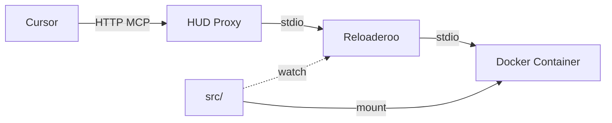

The `hud mcp` command provides a development server that enables hot-reload for MCP environments during development.

## Synopsis

```bash
hud mcp [DIRECTORY] [OPTIONS]
```

## Overview

This command starts a development proxy that:
- Auto-detects or builds Docker images from your environment
- Mounts local source code for instant hot-reload
- Exposes an HTTP endpoint for Cursor integration
- Watches for file changes and automatically restarts

## Options

| Option | Description | Default |
|--------|-------------|---------|
| `DIRECTORY` | Environment directory | `.` (current) |
| `--image, -i` | Docker image name (overrides auto-detection) | Auto-generated |
| `--build, -b` | Build image before starting | `false` |
| `--no-cache` | Force rebuild without cache | `false` |
| `--port, -p` | HTTP server port | `8765` |
| `--no-reload` | Disable hot-reload | `false` |
| `--verbose, -v` | Show server logs | `false` |

## Quick Start

### 1. Basic Usage

Navigate to your environment directory and run:

```bash
cd environments/my-env
hud mcp .
```

Output:
```
📦 Using cached image from pyproject.toml: hud-my-env:dev

"hud-my-env": {
  "url": "http://localhost:8765/mcp"
}
✨ Add to Cursor: cursor://anysphere.cursor-deeplink/mcp/install?name=hud-my-env&config=...

🌐 Reloading proxy live, press Ctrl+C to stop
```

### 2. Build and Run

Build the Docker image first:

```bash
hud mcp . --build
```

This will:
1. Build the Docker image with `:dev` tag
2. Cache the image name in `pyproject.toml`
3. Start the hot-reload proxy

### 3. Cursor Integration

Copy the configuration from the output and add to your Cursor settings, or click the deeplink URL to auto-install.

<Tabs>
<Tab title="Manual Setup">
Add to `.cursor/mcp.json`:
```json
{
  "mcpServers": {
    "hud-my-env": {
      "url": "http://localhost:8765/mcp"
    }
  }
}
```
</Tab>
<Tab title="Quick Install">
Click the deeplink URL provided in the output:
```
cursor://anysphere.cursor-deeplink/mcp/install?name=hud-my-env&config=...
```
</Tab>
</Tabs>

## How It Works

### Image Auto-Detection

The command follows this logic for image names:

1. **Explicit**: Use `--image` if provided
2. **Cached**: Check `pyproject.toml` for cached image name
3. **Auto-generated**: Create name from directory (e.g., `text_2048` → `hud-text-2048:dev`)

### Hot-Reload Architecture



- **reloaderoo**: Watches file changes and restarts the process
- **Docker mount**: Maps `./src` to `/app/src` for instant updates
- **HTTP proxy**: Converts between HTTP and stdio transports

### File Structure Requirements

Your environment must follow this structure:
```
my-environment/
├── Dockerfile
├── pyproject.toml
├── src/
│   └── hud_controller/
│       ├── __init__.py
│       └── server.py    # MCP server entry point
```

The `src/` directory is mounted into the container, so changes here trigger reloads.

## Development Workflow

### 1. Initial Setup

```bash
# Create environment structure
mkdir -p environments/my-env/src/hud_controller
cd environments/my-env

# Create basic server
cat > src/hud_controller/server.py << 'EOF'
from hud.server import MCPServer

mcp = MCPServer(name="My Environment")

@mcp.tool()
async def hello():
    """Say hello"""
    return {"message": "Hello from my environment!"}

if __name__ == "__main__":
    mcp.run()
EOF

# Create Dockerfile
cat > Dockerfile << 'EOF'
FROM python:3.11-slim
WORKDIR /app
COPY pyproject.toml ./
COPY src/ ./src/
RUN pip install -e .
CMD ["python", "-m", "hud_controller.server"]
EOF
```

### 2. Start Development

```bash
# Build and start with hot-reload
hud mcp . --build

# In another terminal, test it works
hud analyze hud-my-env:dev
```

### 3. Make Changes

Edit `src/hud_controller/server.py`:
```python
@mcp.tool()
async def greet(name: str):
    """Greet someone by name"""
    return {"message": f"Hello, {name}!"}
```

The proxy automatically reloads when you save!

## Advanced Usage

### Custom Port

Run on a different port:
```bash
hud mcp . --port 9000
```

### Disable Reload

For debugging reload issues:
```bash
hud mcp . --no-reload
```

### Verbose Logging

See all HTTP requests and server logs:
```bash
hud mcp . --verbose
```

### Force Rebuild

Rebuild without Docker cache:
```bash
hud mcp . --build --no-cache
```

## Image Caching

After first build, the image name is saved in `pyproject.toml`:

```toml
[tool.hud]
image = "hud-my-env:dev"
```

This speeds up subsequent runs. To use a different image:
```bash
hud mcp . --image my-custom:latest
```

## Common Issues

### Reloaderoo Not Found
```
❌ npx not found. Install Node.js or use --no-reload
```

**Solution**: Install Node.js or run with `--no-reload`

### Source Directory Missing
```
❌ Source directory not found: ./src
```

**Solution**: Ensure `src/` directory exists in your environment

### Port Already in Use
```
Address already in use
```

**Solution**: Use a different port with `--port 8766`

## Best Practices

1. **Use :dev tag**: Keep development separate from production images
2. **Mount src/ only**: Don't mount the entire directory for security
3. **Add .dockerignore**: Exclude unnecessary files from builds
4. **Test frequently**: Use `hud analyze` to verify changes work

## CI/CD Integration

For production builds, bypass the dev proxy:

```bash
# Production build
docker build -t my-env:v1.0.0 .

# Test directly
hud debug my-env:v1.0.0
hud analyze my-env:v1.0.0

# Push to registry
docker push my-registry/my-env:v1.0.0
```

## Next Steps

<CardGroup cols={2}>
<Card title="Debug Command" icon="bug" href="/reference/cli/debug">
  Test your environment through 5 phases
</Card>

<Card title="Build Environments" icon="cube" href="/build-environments">
  Learn to build MCP environments
</Card>
</CardGroup>