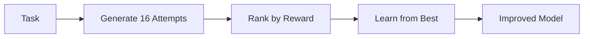

Train agents to perform better on specific tasks using GRPO (Group Relative Policy Optimization).

## Quick Start

### Prerequisites
- GPU with 24GB+ VRAM (A100, RTX 4090)
- Python 3.12+

### Installation

```bash
# Clone repository
git clone https://github.com/hud-evals/hud-python
cd hud-python/rl

# Install with uv (recommended)
uv sync
source .venv/bin/activate
```

### Train 2048 Agent

<Steps>
<Step title="Start vLLM Server">
```bash
# Terminal 1 - GPU 0
CUDA_VISIBLE_DEVICES=0 vf-vllm \
  --model Qwen/Qwen2.5-3B-Instruct \
  --enforce-eager \
  --disable-log-requests
```
</Step>

<Step title="Run Training">
```bash
# Terminal 2 - GPU 1
CUDA_VISIBLE_DEVICES=1 python train_2048.py
```
</Step>
</Steps>

The included `train_2048.py` script trains a 3B model on the 2048 game. Training takes ~30 minutes for 100 steps.

## How It Works

GRPO trains by comparing multiple attempts on the same task:



## Configuration

Training uses YAML configs to map agent tools to MCP tools:

```yaml rl/configs/2048.yaml
system_prompt: |
  You are an excellent 2048 player. 
  Available moves: left(), right(), up(), down(), done()
  Return ONLY: <tool>move()</tool>

action_mappings:
  left:
    _tool: "move"
    direction: {static: "left"}
  right:
    _tool: "move"  
    direction: {static: "right"}
  # ... up, down similar
```

## Custom Training

```python
import verifiers as vf

# Load environment
env = vf.load_environment(
    env_id="hud_vf_gym",
    taskset="your-org/your-taskset",  # HuggingFace dataset
    config_path="./configs/your-env.yaml",
    num_tasks=10
)

# Configure training
model, tokenizer = vf.get_model_and_tokenizer("Qwen/Qwen2.5-3B-Instruct")
args = vf.grpo_defaults(run_name="my-training")
args.max_steps = 100
args.per_device_train_batch_size = 8
args.num_generations = 16

# Train with LoRA
trainer = vf.GRPOTrainer(
    model=model,
    processing_class=tokenizer,
    env=env,
    args=args,
    peft_config=vf.lora_defaults()
)
trainer.train()
```

## Monitoring

Track with Weights & Biases:
```python
args.report_to = "wandb"
os.environ["WANDB_API_KEY"] = "your-key"
```

## Resources

- [Example Training Script](https://github.com/hud-evals/hud-python/blob/main/rl/train_2048.py)
- [HUD VF Gym](https://github.com/hud-evals/hud_vf_gym) - Verifiers integration


