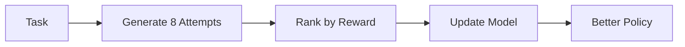

This guide walks you through training an agent to play 2048 using GRPO (Group Relative Policy Optimization). You'll see improvements within 100 training steps.

## Prerequisites

<Card title="GPU Required" icon="microchip">
  This tutorial requires at least one NVIDIA GPU with 24GB+ VRAM (e.g., A100, RTX 4090)
</Card>

Install dependencies:

```bash
# Core dependencies
pip install "hud-python[agent]"
pip install git+https://github.com/willccbb/verifiers.git

# Training dependencies
pip install torch transformers accelerate
pip install wandb  # Optional: for tracking
```

## Step 1: Set Up Environment

Clone the RL training code:

```bash
git clone https://github.com/hud-evals/hud-python
cd hud-python/rl
```

Create configuration for 2048:

```yaml verifiers/configs/2048.yaml
system_prompt: |
  You are playing 2048. Use arrow keys to move tiles.
  
  Available commands:
  - left(): Move tiles left
  - right(): Move tiles right  
  - up(): Move tiles up
  - down(): Move tiles down
  - done(): Finish when you can't move

  Always start by looking at the board state.
  Plan your moves to create larger tiles.

action_mappings:
  left:
    _tool: "move"
    direction: "left"
  right:
    _tool: "move"
    direction: "right"
  up:
    _tool: "move"
    direction: "up"
  down:
    _tool: "move"
    direction: "down"
```

## Step 2: Start vLLM Server

For efficient training, we use vLLM for inference:

<Tabs>
<Tab title="Single GPU">
If you have one GPU, use CPU for vLLM:

```bash
# Terminal 1
vf-vllm \
  --model Qwen/Qwen2.5-3B-Instruct \
  --device cpu \
  --dtype float32
```
</Tab>

<Tab title="Multi GPU">
With multiple GPUs, dedicate one to vLLM:

```bash
# Terminal 1
CUDA_VISIBLE_DEVICES=0 vf-vllm \
  --model Qwen/Qwen2.5-3B-Instruct \
  --enforce-eager \
  --disable-log-requests
```
</Tab>
</Tabs>

<Note>
Keep this terminal running throughout training
</Note>

## Step 3: Create Training Script

Create `train_2048_simple.py`:

```python train_2048_simple.py
import verifiers as vf

# Load environment with HUD tasks
env = vf.load_environment(
    env_id="hud_vf_gym",
    taskset="hud-evals/2048-taskset",
    config_path="verifiers/configs/2048.yaml",
    num_tasks=10  # Use 10 task variations
)

# Load small model for fast training
model_name = "Qwen/Qwen2.5-3B-Instruct"
model, tokenizer = vf.get_model_and_tokenizer(model_name)

# Training configuration
args = vf.grpo_defaults(run_name="2048-quickstart")
args.gradient_accumulation_steps = 2
args.per_device_train_batch_size = 4
args.num_generations = 8  # Generate 8 trajectories per task
args.max_tokens = 512
args.learning_rate = 1e-6
args.max_steps = 100  # Quick training run
args.save_steps = 25
args.logging_steps = 5

# Create trainer with LoRA (efficient fine-tuning)
trainer = vf.GRPOTrainer(
    model=model,
    processing_class=tokenizer,
    env=env,
    args=args,
    peft_config=vf.lora_defaults()  # Only trains ~1% of parameters
)

print(f"Starting training on {len(env.dataset)} tasks")
print(f"Model: {model_name}")
print(f"Device: {args.device}")

# Train!
trainer.train()

# Save final model
trainer.save_model("./trained_2048_model")
print("Training complete! Model saved to ./trained_2048_model")
```

## Step 4: Run Training

Start training in a new terminal:

```bash
# Terminal 2
# Use second GPU if available
CUDA_VISIBLE_DEVICES=1 python train_2048_simple.py
```

You'll see output like:

```
Starting training on 10 tasks
Model: Qwen/Qwen2.5-3B-Instruct
Device: cuda

Step 5: reward=0.125, loss=0.543
Step 10: reward=0.188, loss=0.412
Step 15: reward=0.250, loss=0.387
...
Step 100: reward=0.625, loss=0.234

Training complete! Model saved to ./trained_2048_model
```

<Check>
Reward should increase from ~0.1 to ~0.6 over 100 steps
</Check>

## Step 5: Evaluate Improvements

Test your trained model:

```python evaluate_trained.py
from hud import Task
from hud.agents import OpenAIAgent
import asyncio

# Load your trained model with vLLM
# First, start vLLM with your checkpoint:
# vf-vllm --model ./trained_2048_model

async def evaluate():
    # Create evaluation task
    task = Task(
        prompt="Reach the 512 tile in 2048",
        mcp_config={"hudpython/hud-text-2048:v1.1": {}},
        setup_tool="setup_board",
        evaluate_tool="evaluate_max_tile"
    )
    
    # Use OpenAI agent pointing to your vLLM
    agent = OpenAIAgent(
        model="./trained_2048_model",
        base_url="http://localhost:8000/v1"
    )
    
    # Run 10 evaluations
    successes = 0
    for i in range(10):
        result = await agent.run(task)
        if result.reward >= 512:  # Reached 512 tile
            successes += 1
        print(f"Run {i+1}: Max tile = {result.reward}")
    
    print(f"\nSuccess rate: {successes}/10 ({successes*10}%)")

asyncio.run(evaluate())
```

## Understanding GRPO

GRPO works by:

1. **Generating Multiple Trajectories**: For each task, the model generates N attempts
2. **Ranking by Reward**: Trajectories are sorted by their reward
3. **Learning from Comparisons**: The model learns to prefer high-reward trajectories



## Monitoring Training

### With Weights & Biases

```python
# Add to training script
args.report_to = "wandb"
args.run_name = "2048-training"

# Set API key
import os
os.environ["WANDB_API_KEY"] = "your-key"
```

### Local Metrics

```python
# Training saves logs to
# ./outputs/2048-quickstart/trainer_state.json

import json
import matplotlib.pyplot as plt

# Plot training progress
with open("outputs/2048-quickstart/trainer_state.json") as f:
    state = json.load(f)

steps = [log["step"] for log in state["log_history"] if "reward" in log]
rewards = [log["reward"] for log in state["log_history"] if "reward" in log]

plt.plot(steps, rewards)
plt.xlabel("Training Step")
plt.ylabel("Average Reward")
plt.title("2048 Training Progress")
plt.show()
```

## Next Steps

### Longer Training

For better results, train longer:

```python
args.max_steps = 500
args.save_steps = 50
args.num_generations = 16  # More trajectories
```

### Larger Models

Try 7B models for complex tasks:

```python
model_name = "meta-llama/Llama-3.1-7B-Instruct"
args.per_device_train_batch_size = 2  # Reduce for memory
```

### Custom Environments

Train on your own environment:

```python
# 1. Create your environment
# 2. Create config YAML
# 3. Create taskset
env = vf.load_environment(
    env_id="hud_vf_gym",
    taskset="my-org/my-tasks",
    config_path="configs/my-env.yaml"
)
```

## Troubleshooting

<AccordionGroup>
<Accordion title="CUDA out of memory">
- Reduce `per_device_train_batch_size`
- Reduce `num_generations`
- Use smaller model
- Enable gradient checkpointing
</Accordion>

<Accordion title="vLLM connection error">
- Check vLLM is running: `curl http://localhost:8000/v1/models`
- Ensure correct CUDA_VISIBLE_DEVICES
- Check firewall settings
</Accordion>

<Accordion title="Low rewards">
- Check environment is working: `hud debug hudpython/hud-text-2048:v1.1`
- Verify config YAML matches tools
- Try different hyperparameters
</Accordion>

<Accordion title="Training diverges">
- Lower learning rate
- Reduce batch size
- Check for environment bugs
</Accordion>
</AccordionGroup>

## Resources

<CardGroup cols={2}>
<Card title="Verifiers Gym" icon="dumbbell" href="/train-agents/verifiers-gym">
  Advanced configuration and features
</Card>

<Card title="Example Notebook" icon="book" href="https://github.com/hud-evals/hud-python/blob/main/rl/art/hud_rl_2048.ipynb">
  Complete Colab notebook for 2048 training
</Card>
</CardGroup>


