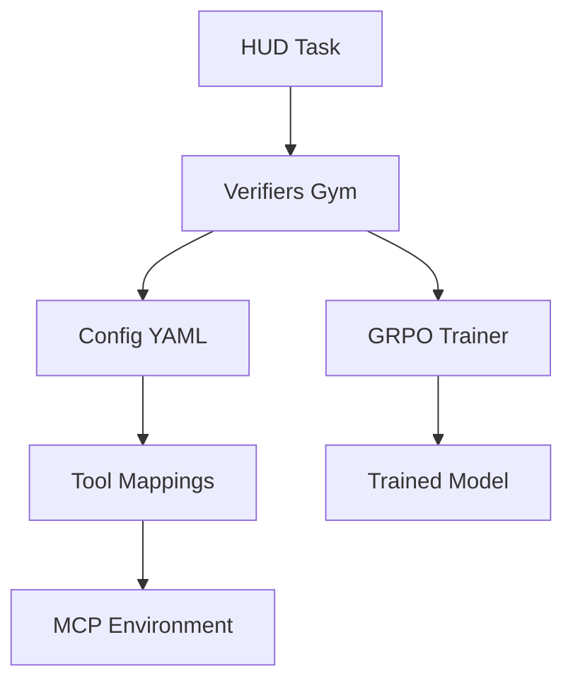

Verifiers Gym provides a powerful, configuration-driven approach to training agents. Define tool mappings in YAML, and the framework handles the complexity of RL training.

## Architecture Overview



## Configuration System

The core innovation is config-driven tool mapping:

### Basic Structure

```yaml config.yaml
# System prompt defines agent interface
system_prompt: |
  You are an AI assistant that can interact with a browser.
  
  Available tools:
  - screenshot(): Take a screenshot
  - click(x, y): Click at coordinates
  - type(text): Type text
  - done(): Complete the task
  
  Use <tool>function(args)</tool> format.

# Map agent tools to MCP tools
action_mappings:
  screenshot:
    _tool: "computer"
    action: "screenshot"
  
  click:
    _parser:
      positional: ["x", "y"]
    _tool: "computer"
    action: "click"
    x:
      from_arg: "x"
    y:
      from_arg: "y"
```

### Advanced Mappings

#### Argument Transformation

```yaml
# Transform arguments before passing to MCP
scroll:
  _parser:
    positional: ["direction", "amount"]
  _tool: "computer"
  action: "scroll"
  coordinate: [640, 400]  # Static center point
  direction:
    from_arg: "direction"
    transform: "lambda d: 'down' if d == 'down' else 'up'"
  amount:
    from_arg: "amount"
    transform: "lambda a: int(a * 120)"  # Convert to pixels
```

#### Context-Aware Transforms

```yaml
# Access other arguments in transforms
drag:
  _parser:
    positional: ["start_x", "start_y", "end_x", "end_y"]
  _tool: "computer"
  action: "drag"
  start_x:
    from_arg: "start_x"
  start_y:
    from_arg: "start_y"
  delta_x:
    transform: "lambda _, ctx: ctx['end_x'] - ctx['start_x']"
    use_context: true
  delta_y:
    transform: "lambda _, ctx: ctx['end_y'] - ctx['start_y']"
    use_context: true
```

#### Multiple Tools

```yaml
# Single agent action can call multiple MCP tools
save_and_close:
  _multi_tool: true
  _tools:
    - tool: "key"
      keys: ["ctrl", "s"]
    - tool: "wait"
      time: 1000
    - tool: "key"
      keys: ["alt", "f4"]
```

## Parser Configuration

Control how agent output is parsed:

```yaml
parser:
  # Thinking mode
  use_thinking: true  # Enable <think> tags
  
  # Scoring weights
  xml_weight: 0.6     # XML format compliance
  action_weight: 0.4  # Action syntax correctness
  
  # Custom patterns
  tool_pattern: '<tool>(.*?)</tool>'
  think_pattern: '<think>(.*?)</think>'
```

### Rubric System

Define custom scoring:

```yaml
rubric:
  weights:
    task_completion: 0.7
    efficiency: 0.2
    style: 0.1
  
  criteria:
    efficiency:
      max_actions: 20
      penalty_per_extra: 0.01
    style:
      prefer_keyboard: true
      penalty_per_click: 0.005
```

## Training Configuration

### GRPO Settings

```python
from verifiers import grpo_defaults

args = grpo_defaults(run_name="browser-training")

# Key hyperparameters
args.per_device_train_batch_size = 8
args.num_generations = 16  # Trajectories per task
args.max_tokens = 1024
args.max_seq_len = 4096
args.learning_rate = 1e-6

# Training schedule
args.num_train_epochs = 3
args.warmup_ratio = 0.1
args.gradient_accumulation_steps = 4

# GRPO-specific
args.grpo_alpha = 0.1  # KL penalty
args.grpo_beta = 0.05  # Entropy bonus
```

### LoRA Configuration

```python
from verifiers import lora_defaults

peft_config = lora_defaults()
# Or customize:
peft_config = LoraConfig(
    r=16,  # Rank
    lora_alpha=32,
    target_modules=["q_proj", "v_proj", "k_proj", "o_proj"],
    lora_dropout=0.1,
    bias="none"
)
```

## Multi-Environment Training

Train on multiple environments:

```python
# Load multiple environments
browser_env = vf.load_environment(
    "hud_vf_gym",
    taskset="web-tasks",
    config_path="configs/browser.yaml"
)

sheets_env = vf.load_environment(
    "hud_vf_gym", 
    taskset="sheets-tasks",
    config_path="configs/sheets.yaml"
)

# Combine with weights
combined = vf.MultiEnvironment(
    environments=[browser_env, sheets_env],
    sample_weights=[0.7, 0.3]  # 70% browser, 30% sheets
)

# Train on combined
trainer = vf.GRPOTrainer(
    model=model,
    env=combined,
    args=args
)
```

## Custom Gym Implementation

Create your own gym wrapper:

```python
from verifiers.env import BaseEnv
from typing import Any, Dict

class CustomGym(BaseEnv):
    def __init__(self, mcp_env, config):
        self.env = mcp_env
        self.config = config
    
    def reset(self, task_id: str) -> Dict[str, Any]:
        """Reset environment for new task"""
        # Initialize MCP environment
        self.env.reset()
        
        # Run setup if defined
        if task.setup_tool:
            self.env.execute(task.setup_tool)
        
        return {"observation": self.env.get_state()}
    
    def step(self, action: str) -> tuple:
        """Execute action and return (obs, reward, done, info)"""
        # Parse action using config
        tool_call = self.parse_action(action)
        
        # Execute in MCP env
        result = self.env.execute(tool_call)
        
        # Check if done
        done = "done()" in action or self.env.is_terminal()
        
        # Calculate reward if done
        reward = 0.0
        if done and task.evaluate_tool:
            eval_result = self.env.execute(task.evaluate_tool)
            reward = eval_result.get("reward", 0.0)
        
        return {
            "observation": result,
            "reward": reward,
            "done": done,
            "info": {}
        }
```

## Advanced Features

### Masked Response Training

Prevent overfitting to environment responses:

```python
args.mask_env_responses = True  # Don't train on tool outputs
```

### Async Generation

Speed up trajectory generation:

```python
args.async_generation = True
args.async_generation_timeout = 900  # 15 minutes
args.vllm_server_url = "http://localhost:8000"
```

### Checkpointing Strategy

```python
# Save best model based on reward
args.save_strategy = "steps"
args.save_steps = 100
args.save_total_limit = 3
args.load_best_model_at_end = True
args.metric_for_best_model = "eval_reward"
```

### Custom Reward Shaping

In your config:

```yaml
reward_shaping:
  # Base reward from evaluation
  base_weight: 0.7
  
  # Efficiency bonus
  efficiency:
    weight: 0.2
    formula: "1.0 - (num_actions / max_actions)"
  
  # Error penalty
  error_penalty:
    weight: 0.1
    per_error: 0.05
```

## Debugging Training

### Enable Verbose Logging

```python
import logging
logging.basicConfig(level=logging.DEBUG)

# In training args
args.logging_level = "debug"
args.logging_steps = 1
```

### Inspect Trajectories

```python
# Save all trajectories
args.save_trajectories = True
args.trajectory_dir = "./trajectories"

# Load and analyze
import json
with open("trajectories/step_100.json") as f:
    trajectories = json.load(f)
    
# Check what model is generating
for traj in trajectories:
    print(f"Task: {traj['task_id']}")
    print(f"Actions: {traj['actions']}")
    print(f"Reward: {traj['reward']}")
```

### Common Issues

<AccordionGroup>
<Accordion title="Config not loading tools">
Check YAML syntax and ensure `_tool` matches MCP tool name exactly
</Accordion>

<Accordion title="Low rewards during training">
- Verify evaluation tools work correctly
- Check reward scaling (should be 0-1)
- Ensure tasks are solvable
</Accordion>

<Accordion title="Model not improving">
- Try higher learning rate (1e-5)
- Increase num_generations
- Check if trajectories show variety
</Accordion>

<Accordion title="Training too slow">
- Use async generation
- Reduce max_tokens
- Use smaller validation set
</Accordion>
</AccordionGroup>

## Production Tips

1. **Start Simple**: Test with 1 task before full dataset
2. **Validate Configs**: Use `yaml.safe_load()` to check syntax
3. **Monitor Memory**: LoRA reduces memory by ~90%
4. **Use Caching**: Cache tokenization for faster startup
5. **Profile Performance**: Find bottlenecks with `torch.profiler`

## Example Configurations

<CardGroup cols={2}>
<Card title="Browser Config" href="https://github.com/hud-evals/hud-python/blob/main/rl/verifiers/configs/default.yaml">
  Full browser automation config
</Card>

<Card title="2048 Config" href="https://github.com/hud-evals/hud-python/blob/main/rl/verifiers/configs/2048.yaml">
  Simple game environment config
</Card>
</CardGroup>

## Next Steps

<Card title="Training Datasets" icon="database" href="/train-agents/datasets">
  Create and manage datasets for training
</Card>


