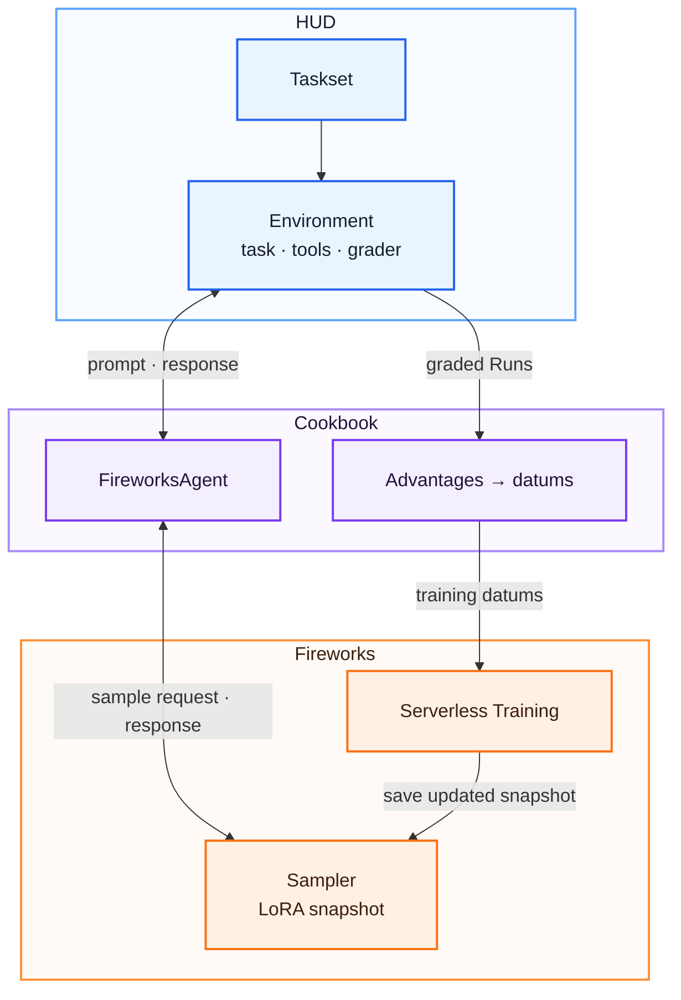

A model trainer needs more than prompts. It needs a repeatable interaction, an execution
environment, and a reward that measures whether the model completed the task. HUD packages those
pieces together, so the same environment can be used to evaluate a model, collect training
rollouts, and verify whether training improved it.

This cookbook connects that environment layer to
[Fireworks Serverless Training](https://docs.fireworks.ai/fine-tuning/training-api/serverless).
The environment author defines the task and reward. HUD executes the environment and grader.
Fireworks samples and trains the model. The cookbook handles orchestration, advantages, and datum
construction between them.

<Card title="Open the source" icon="github" href="https://github.com/hud-evals/hud-python/tree/main/cookbooks/fireworks-rl-training">
  The complete project includes the environment, training loop, tests, and dependency configuration.
</Card>

## Architecture



The boundary between the two systems is explicit:

| HUD | Fireworks |
| --- | --- |
| Defines tasks, tools, state, and graders | Hosts the base model and LoRA adapter |
| Executes rollouts locally or on hosted runtimes | Samples from an adapter snapshot |
| Returns rewards and traces | Runs forward, backward, and optimizer operations |
| Groups repeated attempts at the same task | Stores training state and sampler checkpoints |

The cookbook supplies the `FireworksAgent` adapter, computes group-relative advantages, and converts
completed Runs into Fireworks training datums.

The example uses multiplication because it is small and easy to verify. HUD also represents
environments with browsers, code execution, games, APIs, and stateful tools; the adapter changes
needed for those environments are covered below.

## Setup

Install [Git](https://git-scm.com/downloads), Python 3.11 or 3.12, and
[`uv`](https://docs.astral.sh/uv/getting-started/installation/). Then clone the SDK and enter the
cookbook directory:

```bash
git clone https://github.com/hud-evals/hud-python.git
cd hud-python/cookbooks/fireworks-rl-training
uv sync
```

Run the remaining commands from `hud-python/cookbooks/fireworks-rl-training`.

Set a Fireworks API key with Serverless Training access:

```bash
export FIREWORKS_API_KEY="fw_..."
```

The default configuration uses Qwen 3.8 27B (`accounts/fireworks/models/qwen3p8-27b`)
with tokenizer `Qwen/Qwen3.8-27B`. Fireworks deprecated the Qwen 3.5 9B and Qwen 3.6 27B
Serverless Training pools; see the
[Fireworks changelog](https://docs.fireworks.ai/updates/changelog).
If you change the model, also provide the matching tokenizer and renderer:

```bash
uv run train.py \
  --base-model "<fireworks-model>" \
  --tokenizer-model "<hugging-face-tokenizer>" \
  --renderer "<renderer-name>" \
  --calibrate
```

Prompt rendering happens on the client, so the base model, tokenizer, and renderer must agree. The
default renderer, `qwen3_8_disable_thinking` from `tinker-cookbook>=0.5.7`, disables thinking mode.
This leaves enough of the generation budget for the model to emit the final answer that the
grader reads.

## Define the task and reward

The environment is a normal HUD environment. The task yields a prompt, receives the model response,
and returns an `EvaluationResult`:

```python env.py
import re

from hud import Environment
from hud.graders import EvaluationResult

env = Environment(name="fireworks-arithmetic")

def grade_final_integer(answer: object, expected: int) -> EvaluationResult:
    text = answer if isinstance(answer, str) else str(answer)
    numbers = re.findall(r"[+-]?(?:\d[\d,]*(?:\.\d+)?|\.\d+)(?:[eE][+-]?\d+)?", text)
    final = numbers[-1] if numbers else ""
    got = (
        int(final.replace(",", ""))
        if re.fullmatch(r"[+-]?(?:\d+|\d{1,3}(?:,\d{3})+)", final)
        else None
    )
    return EvaluationResult(
        reward=1.0 if got == expected else 0.0,
        content=text.strip(),
        info={"expected": expected, "got": got},
    )

@env.template()
async def multiply(a: int, b: int):
    answer = yield (
        f"What is {a} * {b}? Work it out, then put the final integer "
        "on its own line at the end of your answer."
    )
    yield grade_final_integer(answer, a * b)
```

The grader belongs to the environment rather than the trainer. That keeps the task definition
portable: the same `multiply` task can be run in an evaluation, used with another model, or sent to
a different training backend without rewriting the reward.

## Calibrate the reward

Group-relative training compares repeated attempts at the same task. If every rollout in a group
receives the same reward, the normalized advantages are zero and the group cannot update the model.

Calibration mode samples from the initial adapter and reports the reward spread without taking an
optimizer step:

```bash
uv run train.py \
  --calibrate \
  --tasks-per-step 6 \
  --group-size 4 \
  --max-tokens 2048 \
  --debug-samples 4
```

| Metric | Interpretation |
| --- | --- |
| `reward_mean` | Overall task difficulty for the current model |
| `within_group_reward_std` | Training signal available within repeated attempts |

Positive `within_group_reward_std` confirms reward variation in at least one group. It does not
prove that the grader is correct. `--debug-samples` prints responses with their rewards and token
counts; verify that better answers receive higher rewards. If all groups are correct, increase the
operand range with `--min-a`, `--max-a`, `--min-b`, and `--max-b`. If all groups are incorrect,
reduce the range or increase `--max-tokens`.

The default uses four-digit operands and a 2,048-token budget. Three-digit tasks were nearly
saturated on Qwen 3.8 27B, while smaller budgets cut off many answers. Inspect the full
`--debug-samples` responses and token counts so truncation is not mistaken for arithmetic difficulty.

## Verify the complete path

After calibration shows useful reward spread, run one bounded training step:

```bash
uv run train.py \
  --steps 1 \
  --tasks-per-step 2 \
  --group-size 4 \
  --max-tokens 2048 \
  --eval-tasks 4 \
  --require-update
```

Groups with identical rewards cannot update the model. `--require-update` makes the command fail
instead of silently skipping the optimizer. A successful run verifies authentication, sampling,
HUD grading, one policy-gradient update, checkpoint creation, and held-out evaluation.
Sampling or grading errors fail the command in every phase, including calibration and evaluation.

## Run the training loop

The default command requests 30 steps × 8 task groups × 8 attempts, or 1,920 training rollouts,
followed by 16 evaluation rollouts:

```bash
uv run train.py
```

Each rollout can generate up to 2,048 tokens and incurs Fireworks usage. Charges include prompt
prefill, sampled output, and training tokens at the selected model's
[serverless rates](https://docs.fireworks.ai/fine-tuning/training-api/serverless#pricing).

Each step saves the current adapter for sampling, runs the HUD taskset, converts graded runs into
training datums, and applies an update when at least one group has reward variation:

_Conceptual excerpt from `train.py`; this is not standalone code._

```python
snapshot = training_client.save_weights_for_sampler(
    f"policy-{step:04d}"
).result()
sampler = service.create_sampling_client(
    model_path=snapshot.path,
    tokenizer=tokenizer,
)

job = await taskset.run(
    agent,
    runtime=runtime,
    group=group_size,
)

datums, kept_groups = make_training_batch(job.runs)
if datums:
    training_client.forward_backward(
        datums,
        "importance_sampling",
    ).result()
    training_client.optim_step(adam).result()
```

`FireworksAgent` adapts the sampler to HUD's `Agent` interface. It records the prompt tokens,
generated tokens, and sampling logprobs on each `Run`. `make_training_batch` then:

1. Groups runs that attempted the same task.
2. Standardizes rewards within each group.
3. Drops groups with no reward variation.
4. Assigns the group advantage to each generated token.
5. Builds the datums expected by the Fireworks training client.

Metrics are written to `runs/fireworks-serverless/metrics.jsonl`. Each row includes mean reward,
within-group reward spread, valid rollout count, retained groups, training datums, whether an update
was applied, loss, snapshot, and step duration.

## Save and resume

Sampling and training checkpoints serve different purposes:

| Checkpoint | Contains | Use |
| --- | --- | --- |
| `policy-*`, `final` | Adapter weights | Bind an in-session sampler or promote the adapter |
| `state-*`, `final-state` | Adapter weights and optimizer state | Resume training |

Resume from a fully qualified training checkpoint:

```bash
uv run train.py --resume-from "<account>/<run-id>/state-0005"
```

Resume restores the checkpoint's original base model. Start a new run to migrate from an older
Qwen model to Qwen 3.8; resuming does not convert the adapter. A supported non-default checkpoint
requires its matching tokenizer and renderer.

The resumed session creates a new Fireworks run and retains the optimizer state. The script prints
the final `Sampler checkpoint` path. Sampler checkpoints are session-scoped, so use that path to
identify and
[promote the checkpoint](https://docs.fireworks.ai/fine-tuning/training-api/serverless#promote-a-sampler-checkpoint-to-a-model)
before the session is removed.

## Use another HUD environment

For a local one-turn environment, pass its tasks and environment files:

```bash
uv run train.py \
  --tasks-file "../my-environment/tasks.py" \
  --env-path "../my-environment/env.py" \
  --calibrate \
  --tasks-per-step 6 \
  --group-size 6
```

Calibration needs at least `--tasks-per-step` tasks. A training run needs
`--tasks-per-step + --eval-tasks`; the script shuffles them deterministically and creates disjoint
training and evaluation subsets.

For a hosted taskset, first
[deploy the environment](/v6/guides/creating-an-environment#deploying-to-the-platform), sync the
tasks, and set `HUD_API_KEY`. Then pass the taskset name or id:

```bash
uv run train.py \
  --taskset "my-taskset" \
  --calibrate \
  --tasks-per-step 6 \
  --group-size 6
```

A hosted run executes the environment and grader on HUD while the cookbook's `FireworksAgent`
continues to call the Fireworks sampler from the training process.

The included `FireworksAgent` and batch builder support one generated assistant response per Run.
Use a different agent adapter and batch builder for tool-using or multi-turn environments so every
trainable assistant turn is recorded and user and tool-result tokens remain masked.

## See also

<CardGroup cols={2}>
  <Card title="Source code" icon="github" href="https://github.com/hud-evals/hud-python/tree/main/cookbooks/fireworks-rl-training">
    Complete runnable project and unit tests.
  </Card>
  <Card title="Training agents" icon="dumbbell" href="/v6/guides/training-agents">
    How HUD turns tasksets, grouped rollouts, and rewards into a training loop.
  </Card>
  <Card title="Designing tasks for training" icon="signal" href="/v6/reference/advice">
    Build rewards with enough signal to distinguish better trajectories.
  </Card>
  <Card title="Fireworks Serverless Training" icon={<svg className="size-6 m-0! shrink-0 bg-primary dark:bg-primary-light" aria-hidden="true" style={{ maskImage: "url(/logo/fireworks.svg)", maskRepeat: "no-repeat", maskPosition: "center", maskSize: "contain", WebkitMaskImage: "url(/logo/fireworks.svg)", WebkitMaskRepeat: "no-repeat", WebkitMaskPosition: "center", WebkitMaskSize: "contain" }} />} href="https://docs.fireworks.ai/fine-tuning/training-api/serverless">
    Fireworks setup, lifecycle, pricing, and supported models.
  </Card>
</CardGroup>
