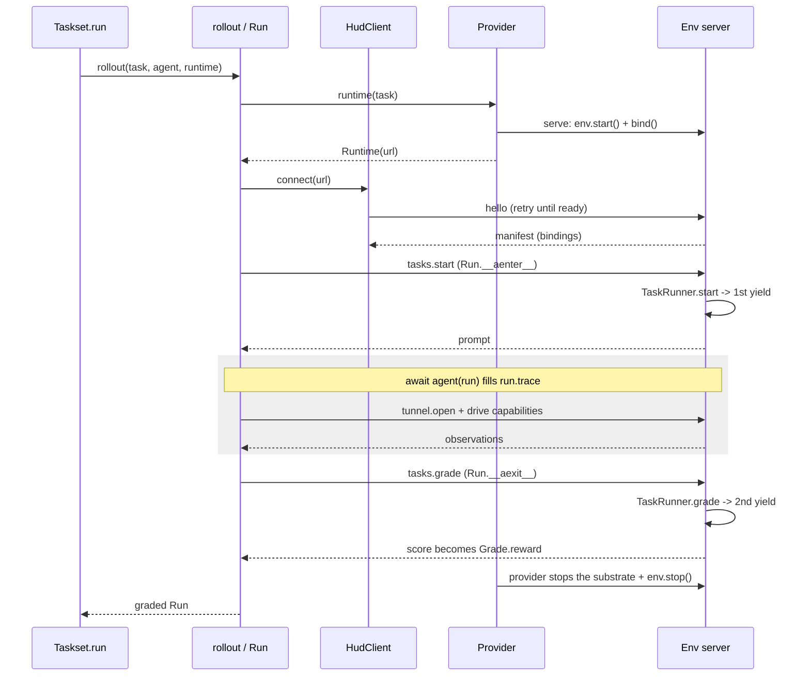

This page is a reading tour of one run through the real code. It begins with the definitions at
rest, enters `Taskset.run`, and follows the pointer into `rollout`, out to the environment server,
through `tasks.start`, into the agent, and back through `tasks.grade`. Irrelevant branches are
trimmed with `# ...`. The primary path has no `Task.verifier`; the optional verifier branch appears
in [grading and teardown](#grading-and-teardown).

On this page: [What we start with](#what-we-start-with) · [Start point: the scheduler](#start-point-the-scheduler) · [Into the rollout atom](#into-the-rollout-atom) · [Bringing up the server](#bringing-up-the-server) · [Connecting](#connecting) · [Starting the task](#starting-the-task) · [Checkpoint](#checkpoint) · [Driving the agent](#driving-the-agent) · [Grading and teardown](#grading-and-teardown) · [The whole chain](#the-whole-chain) · [Boundaries](#boundaries)

## What we start with

Before anything runs, we start with an `env.py` file with the **environment** declaration and **task
templates** registered on it. 

An `@env.template()` decorator turns an async generator into a `_TaskFactory` and stores it in
`env.tasks`. The generator body *is* the task: advancing the generator to first `yield` returns (yields) 
the prompt, the value sent back is
the answer, second `yield` is the score.

```python hud/environment/env.py
env = Environment("robolab", capabilities=[Capability.ssh(name="shell", url=...)])

@env.template()
async def fix_bug(difficulty: int):
    answer = yield f"Fix the bug (difficulty {difficulty})"   # 1st yield -> prompt
    yield 1.0 if check(answer) else 0.0                       # 2nd yield -> score
```

<Accordion title="Advancing fix_bug by hand">
```python
gen = fix_bug(difficulty=3)

prompt = await gen.__anext__()      # advance to the 1st yield; nothing to send in yet
print(prompt)                       # "Fix the bug (difficulty 3)"

score = await gen.asend("patched")  # resumes the paused yield with "patched" as its result
print(score)                        # 1.0, once `check("patched")` returns True
```
Calling `asend(value)` resumes the suspended `yield` expression with `value` - that's the moment
`answer = yield ...` gets populated - then runs the generator forward to the next `yield`, whose
argument becomes `asend`'s return value. The [`TaskRunner.start`](#starting-the-task) call later in
this walkthrough is exactly the `__anext__()` call above; [`TaskRunner.grade`](#grading-and-teardown)
is exactly the `asend(...)` call.
</Accordion>

```python hud/environment/env.py · Environment.template
def decorate(func):
    if not inspect.isasyncgenfunction(func):
        raise TypeError(...)                 # must be `async def ... yield`
    task = _TaskFactory(self, id or func.__name__, description, func, ...)
    self.tasks[task_id] = task               # registered on the env
    return task
```

Calling the factory runs nothing. It binds the args and returns a `Task` row - the row's `env` is
the environment's *name* (a string), not a live object.

```python hud/environment/env.py · _TaskFactory.__call__
def __call__(self, *args, **kwargs) -> EvalTask:
    from hud.eval.task import Task
    bound = self.sig.bind(*args, **kwargs)
    return Task(env=self.env.name, id=self.id, args=dict(bound.arguments))
```

A `Taskset` is just a named collection of those rows, indexed by slug:

```python
taskset = Taskset("bugs", [fix_bug(1), fix_bug(2)])
job = await taskset.run(agent, runtime=LocalRuntime("env.py"))   # <- the pointer starts here
```

## Start point: the scheduler

The pointer enters `Taskset.run`. It expands the rows, registers one `Job`, resolves placement
once, then fans out one `rollout` per (task, group) pair with `asyncio.gather`.

<Accordion title="Full code">
```python hud/eval/taskset.py · Taskset.run
async def run(self, agent, *, runtime=None, group=None, max_concurrent=None, ...):
    group = group or 1

    # expand: task x group; the `group` repeats of one task share a group_id (the GRPO group)
    expanded = []
    for task in list(self):
        group_id = uuid.uuid4().hex
        expanded += [(task, group_id) for _ in range(group)]

    if job is None:                                  # register one platform Job as the receipt
        job = Job(id=uuid.uuid4().hex, name=..., group=group, ...)
        await job_enter(job.id, ...)

    # placement chosen once for the whole batch (the runtime= you passed, or inferred)
    placement = runtime if runtime is not None else self._resolve_placement()
    sem = asyncio.Semaphore(max_concurrent) if max_concurrent else None

    async def _run(task, group_id):
        return [await rollout(task, agent, runtime=placement,       # <- next hop
                              job_id=job.id, group_id=group_id, rollout_timeout=...)]

    async def _one(task, group_id):
        if sem is None:
            return await _run(task, group_id)
        async with sem:                              # cap parallelism
            return await _run(task, group_id)

    waves = await asyncio.gather(*(_one(t, gid) for t, gid in expanded))
    job.runs.extend(run for wave in waves for run in wave)
    return job
```
</Accordion>

<div className="guide-row">
<div className="guide-main">

<div className="part-label">1 · Expand rows into (task, group) pairs</div>

Each row in the taskset becomes `group` entries (default `1`), and the repeats of one task share a
`group_id` - the tag that later ties their rewards together into one GRPO group.

</div>
<div className="guide-aside">

<p className="aside-label">taskset.py · Taskset.run</p>

```python
async def run(self, agent, *, runtime=None,
               group=None, max_concurrent=None, ...):
    group = group or 1
    expanded = []
    for task in list(self):
        group_id = uuid.uuid4().hex
        expanded += [(task, group_id)
                     for _ in range(group)]
```

</div>
</div>

<div className="guide-row">
<div className="guide-main">

<div className="part-label">2 · Register the Job receipt</div>

A `Job` is the accumulator this call fills in and returns - every run below lands in `job.runs`.
`job_enter` registers it with the platform so a running batch shows up before any rollout finishes.

</div>
<div className="guide-aside">

<p className="aside-label">taskset.py · Taskset.run</p>

```python
    if job is None:
        job = Job(id=uuid.uuid4().hex, name=...,
                   group=group, ...)
        await job_enter(job.id, ...)
```

</div>
</div>

<div className="guide-row">
<div className="guide-main">

<div className="part-label">3 · Resolve placement once, cap concurrency</div>

`placement` is resolved once into a single callable, not once per row - though that callable can
itself branch on the task (see [routing patterns](/v6/internals/placement#routing-patterns)). `max_concurrent`
becomes the semaphore's capacity, capping how many rollouts run at once.

</div>
<div className="guide-aside">

<p className="aside-label">taskset.py · Taskset.run</p>

```python
    placement = (runtime if runtime is not None
                 else self._resolve_placement())
    sem = (asyncio.Semaphore(max_concurrent)
           if max_concurrent else None)
```

</div>
</div>

<div className="guide-row">
<div className="guide-main">

<div className="part-label">4 · Fan out one rollout per pair, collect into the job</div>

`_one` is the unit `gather` schedules: acquire the semaphore (if there is one), then call
`rollout` - the next hop. `gather` starts every `_one` at once, but `async with sem:` blocks all
but `max_concurrent` of them until a running rollout exits and frees a slot.

Each `_one` returns a one-`Run` list, so the nested `waves` gets flattened into individual runs
before `job.runs.extend` appends them.

</div>
<div className="guide-aside">

<p className="aside-label">taskset.py · Taskset.run</p>

```python
    async def _run(task, group_id):
        return [await rollout(
            task, agent, runtime=placement,       # <- next hop
            job_id=job.id, group_id=group_id,
            rollout_timeout=...)]

    async def _one(task, group_id):
        if sem is None:
            return await _run(task, group_id)
        async with sem:
            return await _run(task, group_id)

    waves = await asyncio.gather(
        *(_one(t, gid) for t, gid in expanded))
    job.runs.extend(run for wave in waves for run in wave)
    return job
```

</div>
</div>

Everything below happens inside one `rollout(task, agent, runtime=placement, ...)`.

## Into the rollout atom

`rollout` is the whole lifecycle for one task. The key structure is one `AsyncExitStack` that
stacks three context managers - the **provider**, the **client connection**, and the **`Run`** -
and unwinds them in reverse on the way out.

<Accordion title="Full code">
```python hud/eval/run.py · rollout
async def rollout(task, agent, *, runtime, job_id=None, group_id=None, ...):
    if job_id is None:                       # a lone rollout is a job of one
        job_id = uuid.uuid4().hex
        await job_enter(job_id, name=task.id, group=1)
    trace_id = trace_id or uuid.uuid4().hex

    with set_trace_context(trace_id):
        await trace_enter(trace_id, job_id=job_id, group_id=group_id, ...)

        async def _drive():
            nonlocal run, _phase
            async with contextlib.AsyncExitStack() as stack:
                addr   = await stack.enter_async_context(runtime(task))    # 1. provider -> Runtime
                client = await stack.enter_async_context(connect(addr))    # 2. connect -> HudClient
                live = Run(client, task.id, task.args)
                live._runtime = addr.url
                async with live:              # 3. Run.__aenter__ = tasks.start
                    run = live
                    _phase = "agent loop"
                    await agent(run)          #    agent fills run.trace
                                              #    Run.__aexit__ = tasks.grade
                _phase = "grading"

        await _drive()
        # ... failure isolation sets run = Run.failed(...) or marks the trace errored ...
        await trace_exit(run)
    return run
```
</Accordion>

<div className="guide-row">
<div className="guide-main">

<div className="part-label">1 · Give the rollout a job and a trace</div>

A `rollout` called on its own (not through `Taskset.run`) still needs a `Job` and a trace id to
report against, so it mints its own `job_id` and `trace_id` when neither arrives from the caller.

</div>
<div className="guide-aside">

<p className="aside-label">run.py · rollout</p>

```python
async def rollout(task, agent, *, runtime,
                   job_id=None, group_id=None, ...):
    if job_id is None:
        job_id = uuid.uuid4().hex
        await job_enter(job_id, name=task.id, group=1)
    trace_id = trace_id or uuid.uuid4().hex
```

</div>
</div>

<div className="guide-row">
<div className="guide-main">

<div className="part-label">2 · Open the AsyncExitStack: provider, then connect</div>

Two of the stack's three context managers enter here. The provider yields a `Runtime` address;
`connect` turns that address into a live `HudClient`. Exiting `stack` later tears both down, in
reverse order.

</div>
<div className="guide-aside">

<p className="aside-label">run.py · rollout · _drive</p>

```python
async with contextlib.AsyncExitStack() as stack:
    addr = await stack.enter_async_context(
        runtime(task))          # 1. provider -> Runtime
    client = await stack.enter_async_context(
        connect(addr))          # 2. connect -> HudClient
```

</div>
</div>

<div className="guide-row">
<div className="guide-main">

<div className="part-label">3 · Enter the Run, drive the agent</div>

The stack's third context manager is the `Run` itself: entering it sends `tasks.start`, exiting it
sends `tasks.grade` (messages to the environment server). Everything the agent does happens between those two lines, inside
`await agent(run)`.

</div>
<div className="guide-aside">

<p className="aside-label">run.py · rollout · _drive</p>

```python
live = Run(client, task.id, task.args)
live._runtime = addr.url
async with live:          # 3. Run.__aenter__ = tasks.start
    run = live
    _phase = "agent loop"
    await agent(run)      #    fills run.trace
                           #    __aexit__ = tasks.grade
_phase = "grading"
```

</div>
</div>

<div className="guide-row">
<div className="guide-main">

<div className="part-label">4 · Unwind and report</div>

`_drive` runs the whole nested block above; if it raises, failure isolation still produces a `run`
(failed, or with an errored trace) before `trace_exit` closes the trace and the graded - or
failed - `Run` returns.

</div>
<div className="guide-aside">

<p className="aside-label">run.py · rollout</p>

```python
await _drive()
# ... failure isolation sets run = Run.failed(...)
# or marks the trace errored ...
await trace_exit(run)
return run
```

</div>
</div>

The pointer follows `stack.enter_async_context` in order. First stop: `runtime(task)`.

## Bringing up the server

`runtime(task)` calls whichever provider placement resolved - any callable of the shape
`(task) -> async context manager yielding a Runtime` (see [placement](/v6/internals/placement)). This whole
step is the **env side** of the protocol, the provider and the environment together, which the
[agent side](#connecting) then connects to. Two pieces make it up: the environment's serving code,
which runs identically inside whatever substrate holds it, and the provider, which brings that
substrate up and hands back a `tcp://` url reaching its control port.

### The serving code

Every substrate runs one entry point, `serve()` - the `python -m hud.environment.server` a
`SubprocessRuntime` child runs, and the `hud serve` a container CMD runs both land here. It starts the
env, binds the control channel, prints the bound port, and serves until torn down.

```python hud/environment/server.py · serve
async def serve(env, host="127.0.0.1", port=0):
    await env.start()                              # run @env.initialize hooks
    server = await bind(env, host, port)          # bind the control channel
    print(f"HUD_SERVE_PORT={server.sockets[0].getsockname()[1]}", flush=True)  # announce it
    try:
        async with server:
            await server.serve_forever()
    finally:
        await env.stop()                          # @env.shutdown hooks
```

The initialize hooks run *before* serving, so every capability is concrete by the time a client
connects.

```python hud/environment/env.py · Environment.start
async def start(self):
    if self._started:
        return
    self._started = True
    for hook in self._on_start:                     # @env.initialize
        await hook()                                # daemons up, add_capability(...) called here
    self._hooks_done = True
```

Then `bind` puts the env on one TCP port that carries both the control session and raw capability
tunnels - the [control channel](/v6/internals/control-channel). The bound port is the only thing the provider
needs back: child and container substrates announce it on stdout; the in-process provider reads it
straight off the socket.

### The provider

`LocalRuntime` calls `env.start()`, opens a local TCP server, and yields its address.
On exit, it stops the server and calls `env.stop()`. The environment runs in the same
Python process as the agent.

```python hud/eval/runtime/local.py · LocalRuntime.__call__
started = env.start()
await asyncio.wait_for(started, ready_timeout)     # @env.initialize, bounded
server = await bind(env, "127.0.0.1", 0)           # in-process control channel
host, port = server.sockets[0].getsockname()[:2]
serve_task = asyncio.create_task(server.serve_forever())
try:
    yield Runtime(f"tcp://{host}:{port}")          # <- this is `addr` back in rollout
finally:
    serve_task.cancel()
    # ...
    await env.stop()                               # @env.shutdown
```

Blocking environment code stalls other rollouts on the same event loop.
`SubprocessRuntime` starts `python -m hud.environment.server <path> --env name` in a
child process, reads `HUD_SERVE_PORT=` from its output, and stops the process on exit.

Every other provider runs that same serve entry point inside a different substrate and reaches its
port a different way:

| Provider | Substrate | Reaches the control port by |
| --- | --- | --- |
| `LocalRuntime` | this process | reading the bound socket directly (`_local`) |
| `SubprocessRuntime` | a child process on this host | reading `HUD_SERVE_PORT=` from its stdout |
| `DockerRuntime` | a `docker run` container | publishing the port, reading the `docker port` mapping |
| `ModalRuntime` | a Modal sandbox | a raw-TCP tunnel (`unencrypted_ports`) |
| `DaytonaRuntime` | a Daytona sandbox | an SSH local-forward to a local port |
| `HUDRuntime` | a HUD-hosted env | a WebSocket tunnel behind a local TCP listener |
| `Runtime(url)` | one already served elsewhere | nothing - the url passes straight through |

Whichever provider ran, the result is a `Runtime(url)` whose server is listening. The pointer
returns to `rollout` and enters the second context manager: `connect(addr)`.

## Connecting

`connect` retries the connect-and-`hello` handshake until the env answers (a freshly bound port can
accept before the env behind it is serving), then yields a `HudClient` with its `manifest` ready.

```python hud/clients/client.py · connect
@asynccontextmanager
async def connect(runtime, *, ready_timeout=240.0):
    parts = urlsplit(runtime.url)
    client = await _connect_ready(parts.hostname, parts.port, ready_timeout=...)
    try:
        yield client
    finally:
        await client.close()
```

```python hud/clients/client.py · _connect_ready
while True:
    try:
        reader, writer = await asyncio.open_connection(host, port)
    except OSError:
        ...; continue                               # not accepting yet, retry
    client = HudClient(reader, writer, endpoint=(host, port))
    try:
        await client.hello()                        # handshake
    except (EOFError, OSError):
        await client.close(); ...                   # accepted but no env behind it, retry
    else:
        return client
```

`hello()` sends the frame and parses the reply into a `Manifest`. It creates a loopback forwarder
for every binding and records the routed local URL, so all capability traffic returns through the
control address. An optional `session_id` resumes a parked session instead of minting a fresh one;
the [suspended task](/v6/internals/control-channel#the-suspended-task) section describes that path.

```python hud/clients/client.py · HudClient.hello
async def hello(self, session_id=None):
    params = {} if session_id is None else {"session_id": session_id}
    result = await self._call("hello", params)      # -> server session
    bindings = [Capability.from_manifest(b) for b in result["bindings"]]
    self.manifest = Manifest(session_id=result["session_id"], bindings=bindings, ...)
    for capability in bindings:
        forwarder = await asyncio.start_server(
            partial(forward, capability), "127.0.0.1", 0
        )
        self._forwarders.append(forwarder)
        self._routes[capability.name] = ...          # binding() returns the local route
    return self.manifest
```

On the server, the `hello` branch answers with the env identity and its capabilities (the branch
that resumes a requested `session_id` is elided here; see the link above):

```python hud/environment/server.py · _ControlChannel.session (hello)
if method == "hello":
    # ... a requested session_id resumes that parked session instead ...
    bindings = [c.to_manifest() for c in env.capabilities]
    await reply_to(msg_id, {"session_id": session_id,
                            "env": {"name": env.name, "version": env.version},
                            "bindings": bindings})
```

The client holds the manifest. Back in `rollout`, the pointer builds the `Run` and enters it.

## Starting the task

`Run.__aenter__` is the third context manager. It sends `tasks.start` and stores the prompt the
env returns.

```python hud/eval/run.py · Run.__aenter__
async def __aenter__(self):
    started = await self.client.start_task(self._task_id, self._args)   # tasks.start
    self.prompt = started.get("prompt")
    self.record(Step(source="task", task_call=TaskCall(phase="setup", ...)))
    if self.prompt is not None:
        self.record(Step(source="user", messages=self.prompt_messages))
    return self
```

```python hud/clients/client.py · HudClient.start_task
async def start_task(self, task_id, args=None):
    return await self._call("tasks.start", {"id": task_id, "args": args or {}})
```

The frame reaches the server's `tasks.start` branch, which creates a `TaskRunner` and starts it,
holding it on the channel under this connection's session id:

```python hud/environment/server.py · session (tasks.start) + _ControlChannel.start
elif method == "tasks.start":
    prompt = await self.start(session_id, task_id, args)   # _ControlChannel.start
    await reply_to(msg_id, prompt)

async def start(self, session_id, task_id, args):   # _ControlChannel.start
    await self.cancel(session_id)                    # replace this session's own task, if any
    self._runners[session_id] = TaskRunner(self.env.tasks[task_id], args)
    return await self._runners[session_id].start()
```

`TaskRunner.start` instantiates the async generator and runs it to the **first yield** - the
prompt:

```python hud/environment/server.py · TaskRunner.start
async def start(self):
    self._gen = self.task.func(**_coerce_args(self.task.sig, self._args))   # make the generator
    prompt = await self._gen.__anext__()            # run task fn to 1st yield
    frame = prompt if isinstance(prompt, dict) and "prompt" in prompt else {"prompt": prompt}
    return _jsonable(frame)                          # -> back over the wire
```

The prompt travels back: `TaskRunner.start` -> server reply -> `client.start_task` ->
`Run.prompt`.

## Checkpoint

The pointer is inside `async with live:`, just before `await agent(run)`. At this moment
`run` is a `Run` that holds:

<div className="step-list">

- an attached `client` (`run.client`), which already has the `manifest` and whose server has a
  `TaskRunner` suspended at the task's first yield,
- the `prompt` the env returned, on `run.prompt`,
- a `run.trace` containing the task setup step and, when a prompt was returned, its opening user
  step.

</div>

## Driving the agent

`rollout` hands the run to the agent. The agent contract is one method: `async __call__(run)`.

```python hud/eval/run.py · rollout (agent loop)
run = live
async with file_tracking_observer(client):
    await agent(run)                    # Agent.__call__(run)
```

```python hud/agents/base.py · Agent
class Agent(ABC):
    @abstractmethod
    async def __call__(self, run: Run) -> None:
        """Drive run to completion, filling run.trace (answer is trace.content)."""
```

Inside, the agent reads the manifest through the run's client and opens the capabilities it needs,
then loops - acting, observing, recording steps - until it has an answer. Everything it does lands
on `run.trace`; the final answer is `run.trace.content`.

```python
shell = await run.client.open("shell")   # live CapabilityClient (ssh/cdp/mcp/...)
cdp   = run.client.binding("cdp")        # or raw wire data for something else to dial
# ... agent loop: append steps to run.trace; final answer -> run.trace.content ...
```

When `__call__` returns, the pointer leaves the `async with live:` block, which triggers
`Run.__aexit__`.

## Grading and teardown

`Run.__aexit__` sends `tasks.grade` with the answer taken from `trace.content`, and parses the
reply into a `Grade` (the env's `score` becomes `reward`). On a Ctrl-C it cancels instead of
grading.

```python hud/eval/run.py · Run.__aexit__
async def __aexit__(self, exc_type, exc, tb):
    if exc_type in (asyncio.CancelledError, KeyboardInterrupt):
        await self.client.cancel(); return False
    answer = {"answer": self.trace.content}
    evaluation = await self.client.grade(answer)    # tasks.grade
    self.grade = Grade.from_dict(evaluation)        # score -> run.grade.reward
    self.record(Step(source="task", task_call=TaskCall(phase="evaluate", ...)))
    return False
```

The server's `tasks.grade` branch pops this session's held runner and resumes it (or, with no
runner of its own, adopts the lone parked one - see
[the suspended task](/v6/internals/control-channel#the-suspended-task)):

```python hud/environment/server.py · session (tasks.grade) + _ControlChannel.grade
elif method == "tasks.grade":
    evaluation = await self.grade(session_id, params)   # _ControlChannel.grade
    await reply_to(msg_id, evaluation)

async def grade(self, session_id, payload):          # _ControlChannel.grade
    runner = self._runners.pop(session_id, None)      # this session's own task ...
    if runner is None:
        runner = self._adopt_parked()                 # ... or the lone parked one
    return await runner.grade(payload)
```

`TaskRunner.grade` sends the answer into the paused generator (optionally wrapped as `Answer[T]`
when `returns=` was declared), which advances past the first yield, evaluates, and yields the
**score**:

```python hud/environment/server.py · TaskRunner.grade
async def grade(self, payload):
    evaluation = await self._gen.asend(_build_answer(self.task.return_type, payload))  # 2nd yield
    # ... normalize dict / EvaluationResult ...
    return {"score": _score_value(evaluation)}
```

The score travels back: `TaskRunner.grade` -> server reply -> `client.grade` -> `Grade.from_dict`
-> `run.grade.reward`.

When `task.verifier` is present, the actor grade is provisional. A verifier in the same environment
with no row-level runtime configuration starts on the existing client. Otherwise the actor client
and provider exit before the same provider is called with the verifier row. `_verify` starts that
task without an agent loop and immediately grades it with the actor result frame; its evaluation
replaces the actor grade. The full phase contract is documented in
[verifier environments](/v6/experimental/verifier-environments#provisioning-order).

The `AsyncExitStack` unwinds in reverse: `connect` closes the client (forwarders and socket),
then the provider context exits and tears the substrate down - for `LocalRuntime` it cancels the
in-process server and runs `env.stop()` (`@env.shutdown`); for `SubprocessRuntime` it terminates
the child, whose `serve` does the same on the way out. Back in `rollout`,
`trace_exit(run)` reports the trace and the graded `Run` returns to `Taskset.run`, which collects it
into `job.runs`.

## The whole chain

Every hop above, in order:

<div className="step-list">

1. `Taskset.run` - expand rows, register a `Job`, resolve placement, `gather` one `rollout` per (task, group).
2. `rollout` - open an `AsyncExitStack`: provider, then connect, then `Run`.
3. `runtime(task)` - bring the env up in its substrate: `LocalRuntime` serves it in-process via `_local`; `SubprocessRuntime` spawns the serve entry point and reads its announced port.
4. `serve` (in the substrate) - `env.start()` (initialize hooks), `bind()` a TCP server, `serve_forever()`; the provider yields a `Runtime(url)`.
5. `connect(addr)` - retry until ready, `HudClient.hello()` -> server returns the `manifest`.
6. `Run.__aenter__` - `client.start_task` -> `tasks.start` -> `TaskRunner.start` runs the generator to the first yield -> `prompt` back on `run.prompt`.
7. **Checkpoint** - `run` holds a live client (manifest + suspended runner) and the prompt.
8. `await agent(run)` - agent opens capabilities via `run.client`, loops, fills `run.trace` (answer on `trace.content`).
9. `Run.__aexit__` - `client.grade` -> `tasks.grade` -> `TaskRunner.grade` resumes the generator to the second yield -> provisional `score` -> `run.grade.reward`.
10. Optional verifier - reuse the live substrate or finish actor cleanup and acquire the verifier substrate; start and grade the verifier with the actor result; replace the actor grade.
11. Unwind - close the active client, stop the substrate (`serve` runs `env.stop()`), `trace_exit`, return the graded `Run` to `Taskset.run`.

</div>



## Boundaries

This reading path exposes the boundaries encoded by the rollout engine.

<div className="step-list">

- **Each provider acquisition yields one control-channel address.** The address can represent a
  process, one container, or a Compose project whose `main` service owns the channel. A verifier in
  another environment causes a second acquisition after the actor acquisition exits.
- **A control channel holds one suspended task per session.** A `_ControlChannel` keys its
  suspended `TaskRunner`s by session id, so concurrent sessions each own their own, and a dropped
  connection parks its session's task for a later one to grade (see the
  [control channel](/v6/internals/control-channel#the-suspended-task)). Vectorized robot sims reuse that
  shape: N sessions on one control port, each claiming a bridge slot by token.
- **The agent loop runs in the caller's process.** Every provider except `HostedRuntime` is
  *client-here*: the substrate can be anywhere, but `agent(run)` executes locally. With the
  default `LocalRuntime` the env serves in this same process too, so its hooks share the caller's
  event loop and blocking env code stalls concurrent rollouts; `SubprocessRuntime` and
  `DockerRuntime` move the env to its own substrate, where hooks run isolated from the caller.
- **Every capability is concrete by `hello` time.** `env.start()` runs all initialize hooks before
  serving, and the manifest is negotiated once. A capability published later will not appear in an
  already-connected client.
- **A template generator is single-use per start.** `grade` closes it after the second yield, so
  one `TaskRunner` grades exactly once; re-running the task means a fresh `tasks.start`.
- **Placement is chosen once per batch.** `Taskset.run` resolves one provider for all rows. Per-row
  heterogeneity is possible only because the `Provider` contract takes the `task` and can branch on
  it - the engine never does.

</div>
